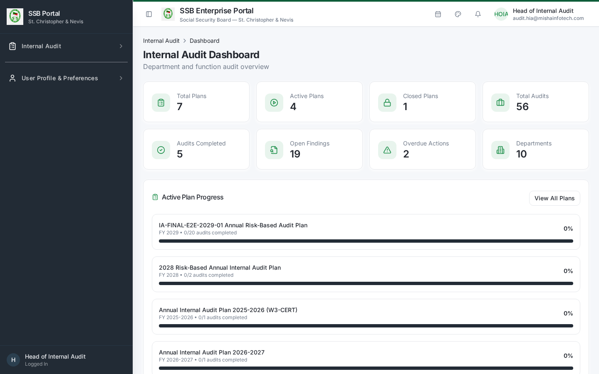
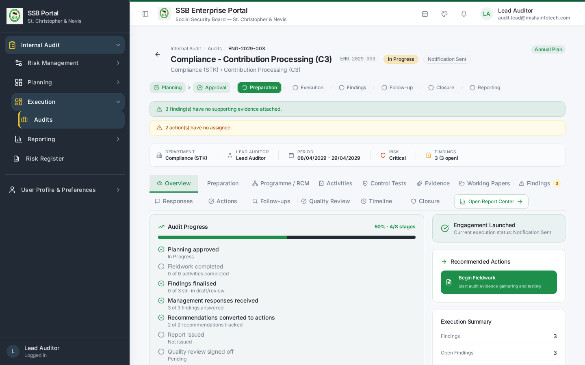
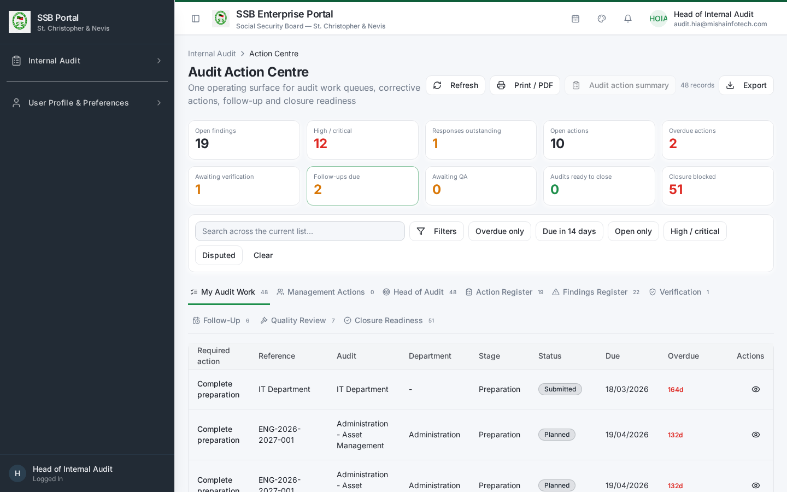
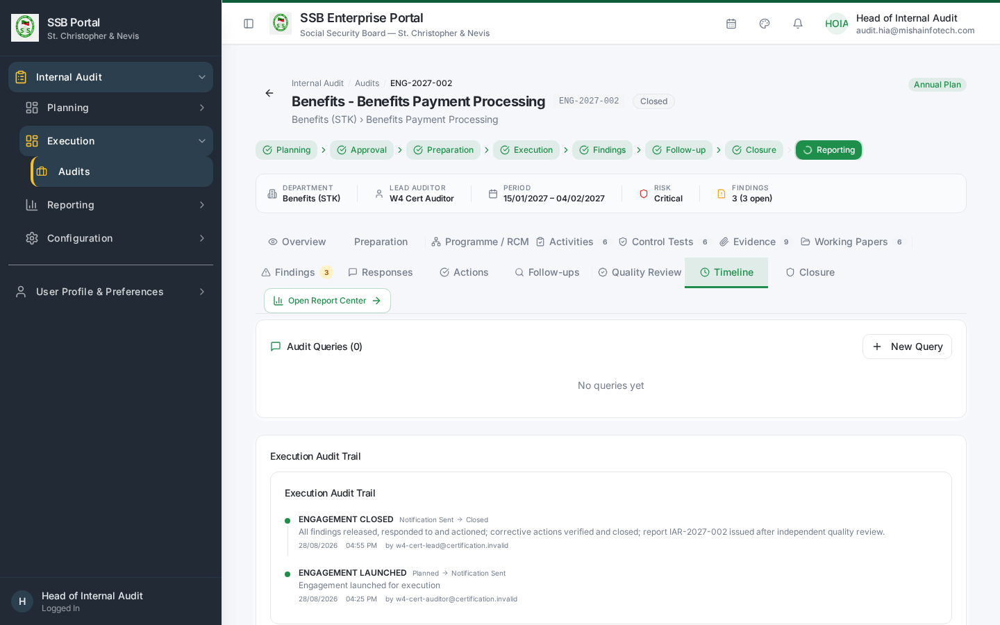

# Internal Audit Module — User Manual

**Audience:** all Internal Audit users
**Environment shown:** TEST instance (screenshots captured from the live application)
**Module prefix:** Internal Audit (`/audit/*`)

This manual set is organised by role. Start here for the shared concepts, then read the
manual for your own role.

| # | Role manual | Who it is for |
|---|-------------|---------------|
| 01 | [Head of Internal Audit](01-Head-of-Internal-Audit.md) | Owns the annual plan, approvals, closure and board reporting |
| 02 | [Lead Auditor](02-Lead-Auditor.md) | Runs engagements: preparation, programme, fieldwork, issuance |
| 03 | [Audit Team Member](03-Audit-Team-Member.md) | Control testing, evidence, working papers, findings |
| 04 | [Quality Reviewer](04-Quality-Reviewer.md) | Independent quality review and sign-off |
| 05 | [Management Respondent](05-Management-Respondent.md) | Audited department: responses, corrective actions, evidence |
| 06 | [Audit Administrator](06-Audit-Administrator.md) | Master data, risk configuration, settings, templates |

---

## 1. The audit lifecycle

```text
Master data      Risk            Planning         Execution              Resolution
-----------      ----            --------         ---------              ----------
Departments  ->  Risk        ->  Annual plan  ->  Preparation        ->  Management response
Functions        assessment      Approval         Programme / RCM        Corrective action
Auditors         Risk matrix     Launch           Fieldwork & evidence   Follow-up verification
                 Risk register                    Findings               Quality review
                                                  Report issuance        Engagement closure
                                                                         Plan closure
```

Each stage is gated. The application will not let a stage advance until the previous stage's
dependencies are satisfied, and the gates are enforced on the server — not just in the screen.

## 2. Navigation

Internal Audit appears in the left sidebar. The groups and their entries are:

| Group | Entry | Route |
|-------|-------|-------|
| Dashboard | Dashboard | `/audit/dashboard` |
| Reference data | Departments | `/audit/departments` |
| Reference data | Business Functions | `/audit/functions` |
| Reference data | Risk Register | `/audit/risk-register` |
| Risk | Risk Assessment | `/audit/risk-assessment` |
| Risk | Entity Risk Summary | `/audit/entity-summary` |
| Risk | Risk Matrix | `/audit/risk-matrix` |
| Planning | Audit Plans | `/audit/audit-plans` |
| Planning | Plan Approval | `/audit/plan-approval` |
| Execution | Audits (engagements) | `/audit/audits` |
| Execution | Audit workspace | `/audit/audits/:id` |
| Execution | Audit Queries | `/audit/queries` |
| Resolution | Action Centre | `/audit/action-centre` |
| Resources | Auditor Profiles | `/audit/auditors` |
| Resources | Workload & Capacity | `/audit/workload` |
| Resources | Time Tracking | `/audit/time-tracking` |
| Resources | Auditor Leave | `/audit/leave` |
| Reporting | Report Center | `/audit/audit-reports` |
| Reporting | Report Builder | `/audit/report-builder` |
| Reporting | Engagement Summary | `/audit/reports/engagement-summary` |
| Reporting | Plan Slippage | `/audit/reports/plan-slippage` |
| Reporting | Overdue Actions | `/audit/reports/overdue-actions` |
| Reporting | Carry-Forward Aging | `/audit/reports/carry-forward-aging` |
| Reporting | Communication Compliance | `/audit/reports/communication-compliance` |
| Configuration | Audit Configuration | `/audit/config` |
| Configuration | Risk Configuration | `/audit/risk-settings` |
| Configuration | Document & Output Settings | `/audit/document-templates` |
| Configuration | Escalation Roles | `/audit/escalation-roles` |
| Configuration | Communication Templates | `/audit/templates` |

You only see the entries your role is entitled to. A Management Respondent, for example, sees
a restricted **Internal Audit → Management Workspace** group with four entries only: My Work,
Findings Register, Corrective Actions and Follow-Ups.



## 3. The audit workspace

Every engagement opens as a single workspace at `/audit/audits/:id` with a lifecycle stepper
and these tabs:

| Tab | Purpose |
|-----|---------|
| Overview | Lifecycle stage, server-derived progress, recommended next actions |
| Preparation | Notification, kick-off, scope confirmation, preliminary documents |
| Programme | Risk Control Matrix — processes, risks, controls, tests |
| Activities | Fieldwork activities and their completion |
| Control Tests | Test execution and Pass / Fail / Partial results |
| Evidence | Evidence files supporting tests and findings |
| Working Papers | Structured working paper records |
| Findings | Findings, severity, root cause, recommendations |
| Responses | Management responses per finding |
| Actions | Corrective actions with owner, target date, status |
| Follow-Ups | Independent verification of implemented actions |
| Quality Review | QA checklist, rating, rework or satisfactory sign-off |
| Timeline | Every governed event and every communication sent |
| Closure | Closure readiness, blockers, final rating, closure decision |



## 4. The Action Centre

`/audit/action-centre` is the cross-engagement work queue. Tabs:

| Tab | Shown to | Purpose |
|-----|----------|---------|
| My Audit Work | Audit team | Everything assigned to you across engagements |
| Management Actions | All | Responses and corrective actions owed by management |
| Head of Audit | Audit team | Items needing the Head's attention |
| Action Register | All | Every corrective action, filterable and exportable |
| Findings Register | All | Every finding with severity and response status |
| Verification | Audit team | Actions claimed complete, awaiting audit verification |
| Follow-Up | All | Scheduled follow-up verifications |
| Quality Review | Audit team | QA queue |
| Closure Readiness | Audit team | Engagements ready — or blocked — for closure |

Filters: annual plan, audit, department, function area, action owner, severity, action
status, finding status and a due-date range. Export produces CSV/Excel matching the filtered
row count shown next to the Export control.



## 5. Communications

Internal Audit never sends email or in-app messages directly. Every notification —
engagement notification, information request, response reminder, action due-soon and
overdue escalation, report issuance, closure — is emitted as a catalogued business event
and delivered by the platform's governed communication service. Delivery outcomes are
visible on the engagement Timeline tab and in the Communication Compliance report.



## 6. Governance principles you will meet in the screens

1. **Server-enforced gates.** Launch, closure, plan closure, report issuance and action
   verification run as governed database commands. If a precondition fails, the screen shows
   the specific blocking items instead of a generic error.
2. **Segregation of duties.** The person who prepares is not the person who approves. Where
   the same person must act twice (for example a small audit shop), the system records a
   logged exception rather than silently allowing it.
3. **Immutable history.** Closure decisions, approvals, response versions and quality
   sign-offs are appended, never overwritten.
4. **Terminology.** The audited party is the *Audited Department* with a *Management
   Respondent* and a *Corrective Action Owner*.

## 7. Glossary

| Term | Meaning |
|------|---------|
| Annual Plan | The approved portfolio of audits for a fiscal year |
| Engagement / Department Audit | One audit of one department, in or out of the annual plan |
| RCM | Risk Control Matrix: process → risk → control → test |
| Finding | A confirmed control weakness with severity and root cause |
| Management Response | The audited department's position on a finding |
| Corrective Action | The remedial action with an owner and target date |
| Follow-Up | Independent audit verification that an action was really implemented |
| Closed – Actions Pending | Engagement closed while corrective actions remain open |
| Carry Forward | An engagement moved into the next year's plan at plan closure |

---

## Document Control — Version History & Change Log

**Document owner:** Head of Internal Audit  **Classification:** Internal  
**Review cycle:** Annually, or on any change to the Internal Audit module.

| Version | Date | Author | Summary of change | Approval |
|---------|------|--------|-------------------|----------|
| 1.0 | 2026-08-30 | Internal Audit / Platform Team | First issued manual, generated from the live TEST environment (routes, tabs, governed commands and screenshots). | Reviewed: Lead Auditor. Approved by Head of Internal Audit on: _Pending_ |

### How to record an update
1. Add a new row at the top of the table for every content change — never edit a released row.
2. Increment the minor version (1.1, 1.2 …) for clarifications and screenshot refreshes;
   increment the major version (2.0) when a process, role or gate changes.
3. State the change in business terms (what a reader must now do differently), not file edits.
4. The manual is only "released" once the Head of Internal Audit records an approval date.
   Until then it is marked *Pending* and must not be used as certification evidence.
5. Re-export the PDF and DOCX from the Internal Audit User Manuals page after each approval.

### Change log

| Version | Change | Sections affected |
|---------|--------|-------------------|
| 1.0 | Initial release. | All |
