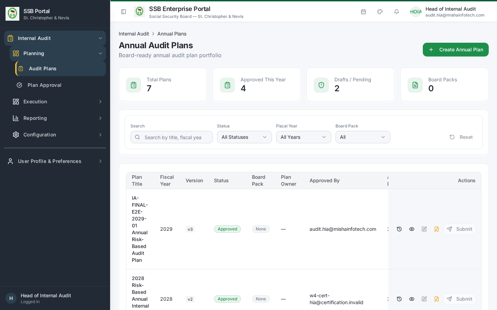
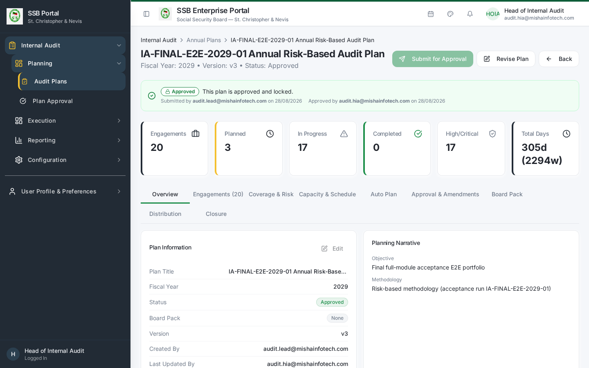
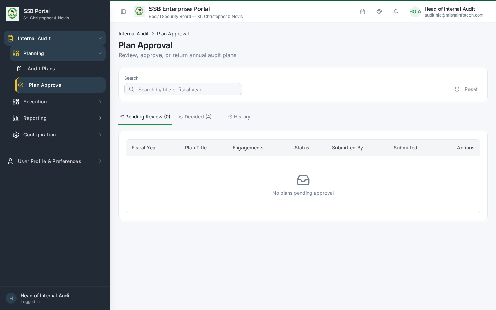
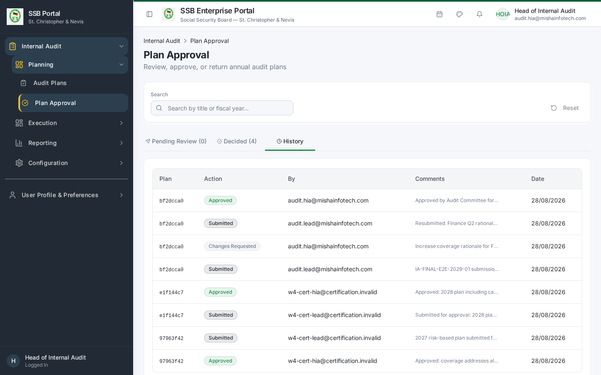
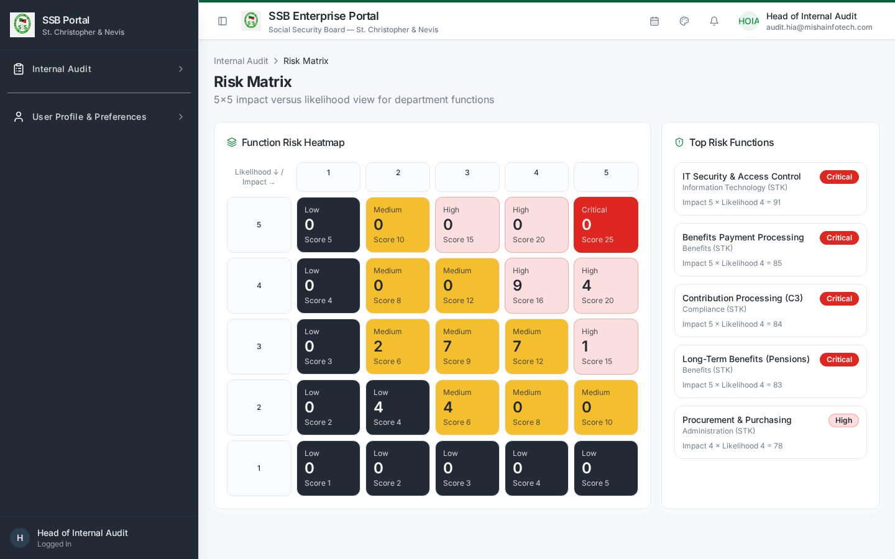
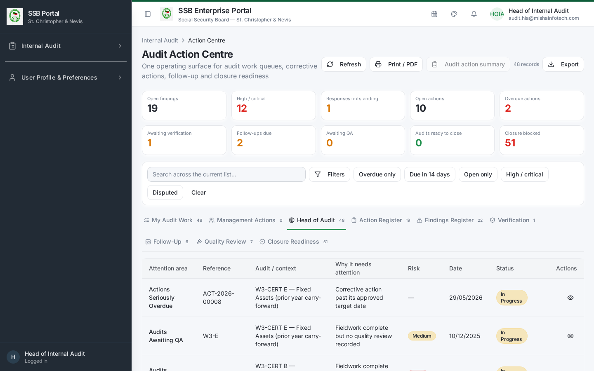
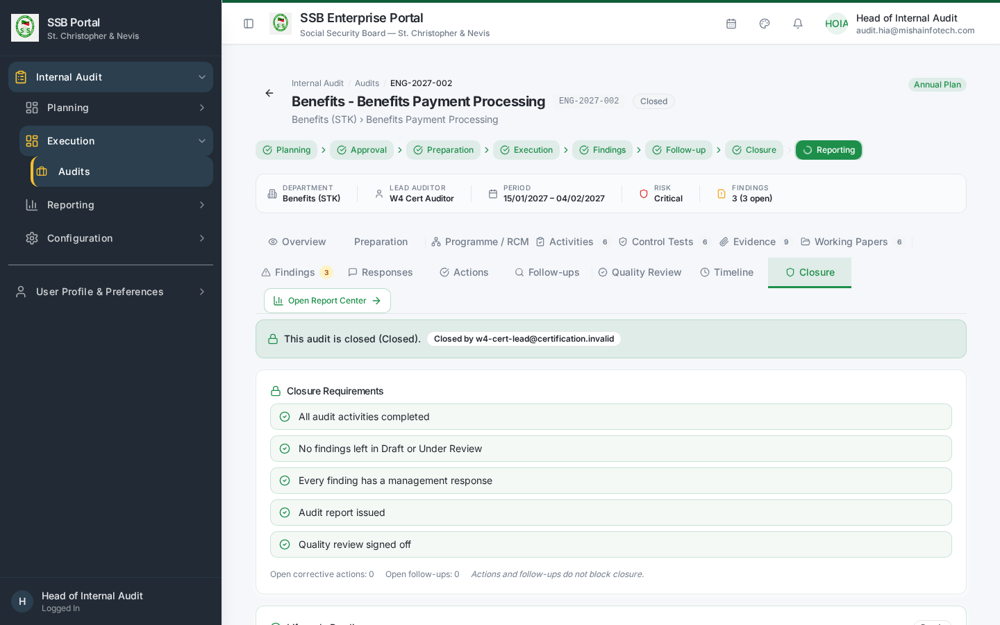
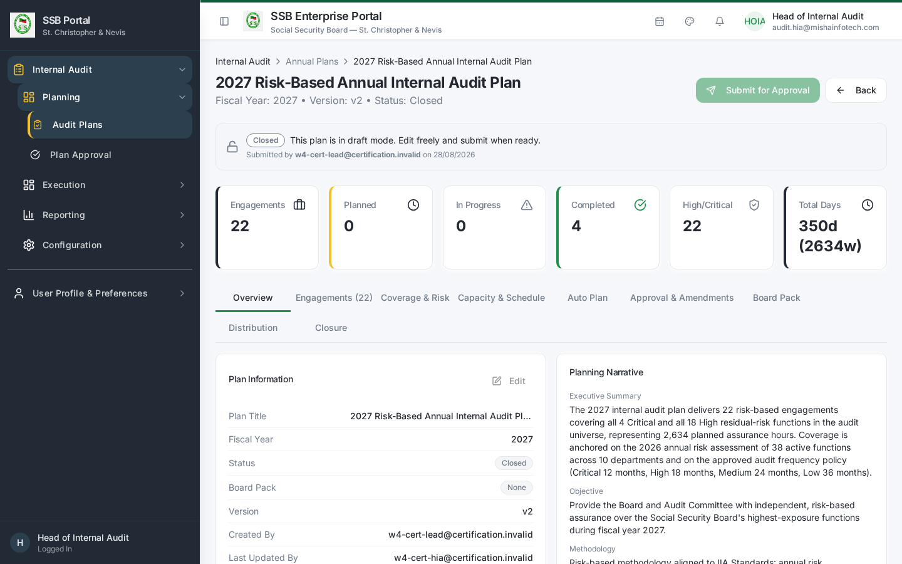
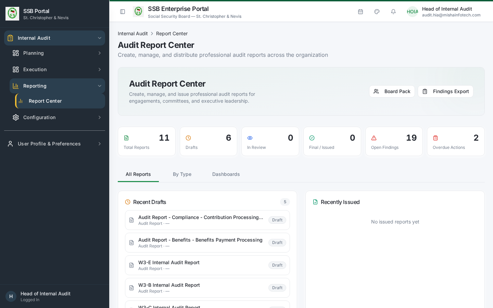
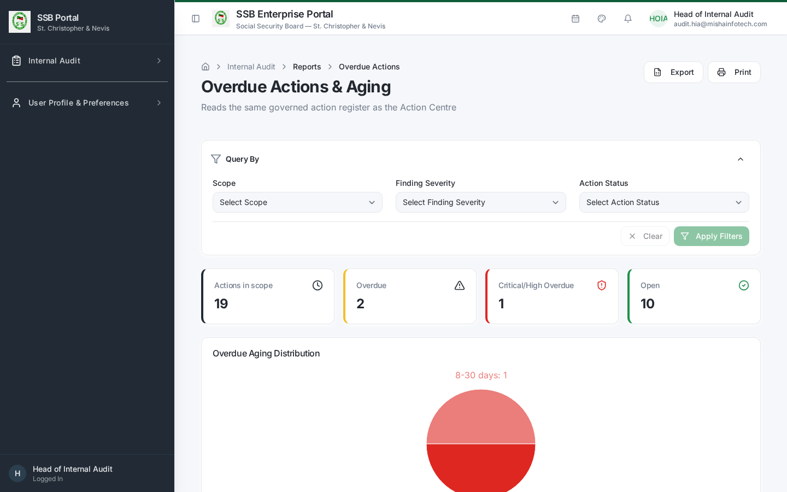

# Internal Audit — Head of Internal Audit Manual

**Role:** Head of Internal Audit (HIA)
**Test account:** `w4-cert-hia@certification.invalid`
**Owns:** annual planning, plan approval, resourcing oversight, engagement and plan closure,
board / audit committee reporting.

---

## 1. Your dashboard

`/audit/dashboard`

The dashboard reconciles with the database and shows the plan portfolio, active plan
progress, engagement states, findings by severity and overdue corrective actions.

## 2. Annual planning

### 2.1 Build the plan
1. Internal Audit → **Audit Plans** (`/audit/audit-plans`) → **New Plan**.
2. Enter title and fiscal year. The plan opens in **Draft**.
3. Add engagements. Candidates are proposed from the audit universe and risk ratings —
   high and critical entities are proposed at a higher audit frequency.
4. For each engagement set the audited department, functions in scope, objectives, scope,
   planned start / end, lead auditor and team members.
5. Record planning assumptions and constraints (resource days, leave, holidays).

### 2.2 Resource check before submitting
Cross-check the draft against capacity:
- **Workload & Capacity** (`/audit/workload`) — auditor availability against planned days.
- **Auditor Leave** (`/audit/leave`) — approved leave in the planning window.

### 2.3 Submit and approve
1. **Submit for Approval** on the plan detail screen. The plan version increments.
2. Internal Audit → **Plan Approval** (`/audit/plan-approval`) shows the approval queue with
   Pending / Decided tabs and full approval history.
3. Open the plan, review, then **Approve** or **Return for Revision** with comments.
4. On approval the status becomes **Approved**, the approver and date are stamped, and the
   plan appears in Active Plan Progress on the dashboard.

> **Segregation of duties.** If you both prepared and approved the plan, the system records a
> logged SoD exception on the approval action. Have a second approver where your charter
> requires it.

### 2.4 Amending an approved plan
Amendments are versioned. Each change records the field, old value, new value, reason and
requester. The **Revise Plan** guard in Audit Settings decides whether a revision to an
in-flight plan is blocked, warned or allowed. When a plan is superseded you are prompted, per
in-flight engagement, to **Carry Forward** or **Suspend**.

## 3. Risk oversight

- **Risk Matrix** (`/audit/risk-matrix`) — the likelihood × impact heat map used to justify
  the plan.
- **Entity Risk Summary** (`/audit/entity-summary`) — risk position per audited entity.
- **Risk Register** (`/audit/risk-register`) — the standing register of risks by department
  and business function.

## 4. Monitoring in-flight work

Internal Audit → **Action Centre** (`/audit/action-centre`).

- **Head of Audit** tab — items escalated to you: overdue responses, overdue high/critical
  actions, engagements past planned end date.
- **My Audit Work** — anything assigned to you personally.
- **Closure Readiness** — engagements that can be closed and, for those that cannot, the exact
  blocking items.

## 5. Closing an engagement

1. Open the engagement → **Closure** tab.
2. The screen evaluates closure readiness on the server and lists any blockers:
   - all activities Completed;
   - no finding left in Draft or Under Review;
   - every finding carries a management response;
   - the audit report is **Issued**;
   - quality review signed off.
   Corrective actions and follow-ups do **not** block closure.
3. Record the final audit rating and closure remarks.
4. Choose the terminal state:
   - **Closed** — nothing outstanding.
   - **Closed – Actions Pending** — closed with open corrective actions, which continue to be
     monitored in the Action Centre and keep emitting reminders.
5. Confirm. The closure event is written to the timeline and cannot be edited afterwards.

## 6. Closing the annual plan

1. Internal Audit → **Audit Plans** → open the plan → **Closure** panel.
2. Every engagement in the plan must carry a disposition:
   | Disposition | Use when |
   |-------------|----------|
   | Closed | The audit finished with nothing outstanding |
   | Closed – Actions Pending | Finished, corrective actions still open |
   | Cancelled | Not performed — a reason is mandatory |
   | Carried Forward | Moved into the next fiscal year plan — a reason is mandatory |
3. Engagements still sitting untouched at **Planned** block plan closure.
4. Confirm closure. The system generates the closure summary: planned, completed, actions
   pending, carried forward, cancelled and the completion rate, and creates the lineage link
   from carried-forward engagements to the successor plan.

## 7. Reporting to the board / audit committee

Internal Audit → **Report Center** (`/audit/audit-reports`) plus the governed reports:

| Report | Route | Answers |
|--------|-------|---------|
| Engagement Summary | `/audit/reports/engagement-summary` | State and outcome of every engagement |
| Plan Slippage | `/audit/reports/plan-slippage` | Planned vs actual execution dates |
| Overdue Actions | `/audit/reports/overdue-actions` | Ageing of unimplemented corrective actions |
| Carry-Forward Aging | `/audit/reports/carry-forward-aging` | How long carried-forward audits have been deferred |
| Communication Compliance | `/audit/reports/communication-compliance` | Whether every required audit notification was delivered |

All reports export to CSV / Excel / PDF, and the plan distribution pack is delivered to the
audit committee through the governed communication service with the report attached and
checksum-verified.

## 8. Your day-to-day checklist

| Frequency | Action |
|-----------|--------|
| Daily | Action Centre → Head of Audit tab; clear escalations |
| Weekly | Closure Readiness; Plan Slippage |
| Monthly | Overdue Actions; management response ageing |
| Quarterly | Committee pack from Report Center; carry-forward ageing |
| Annually | Risk assessment refresh → next-year plan → approval → prior-year plan closure |
