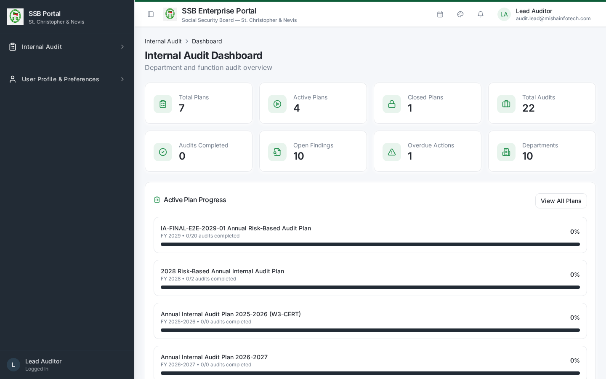
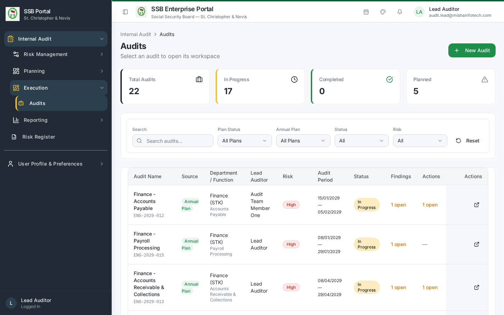
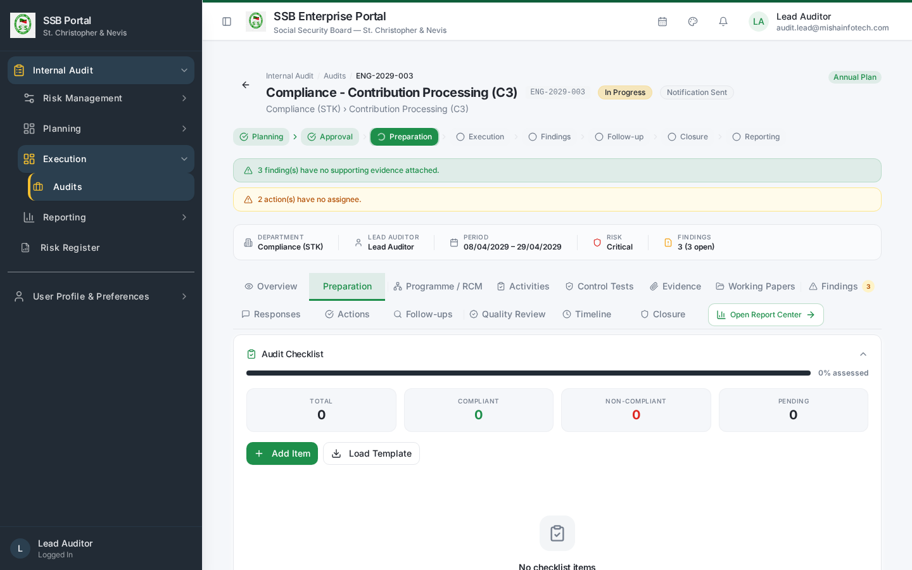
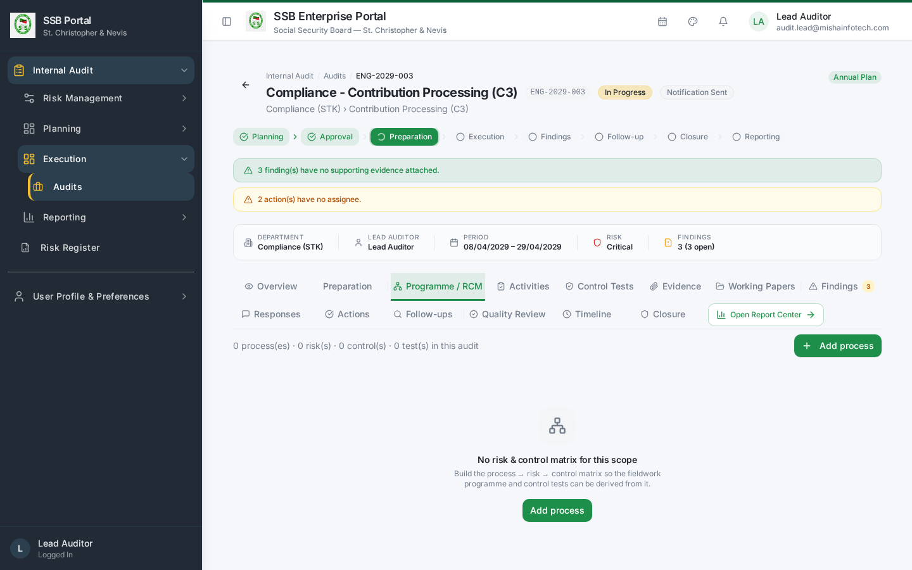
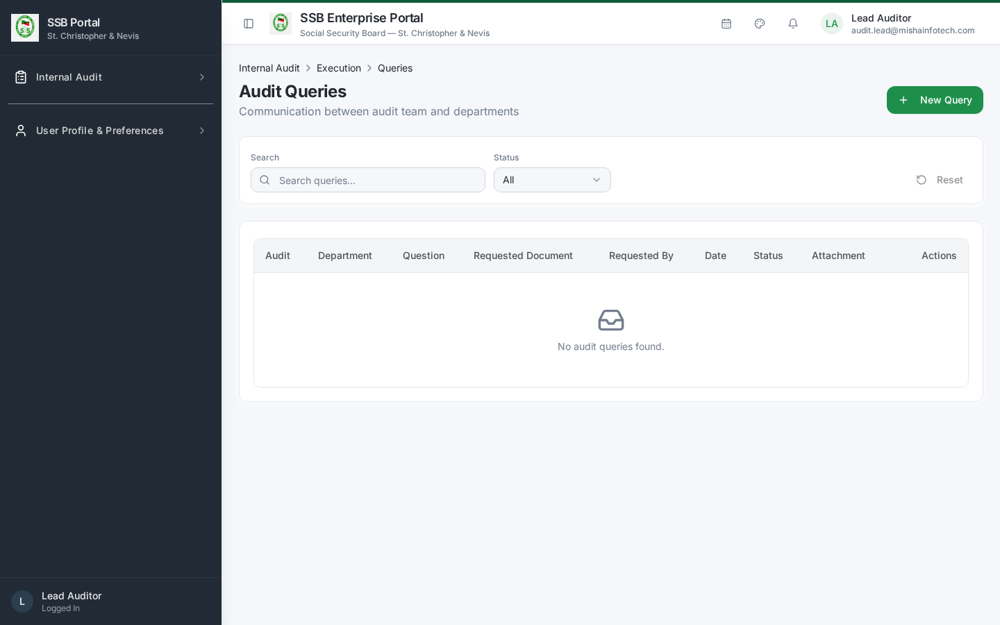
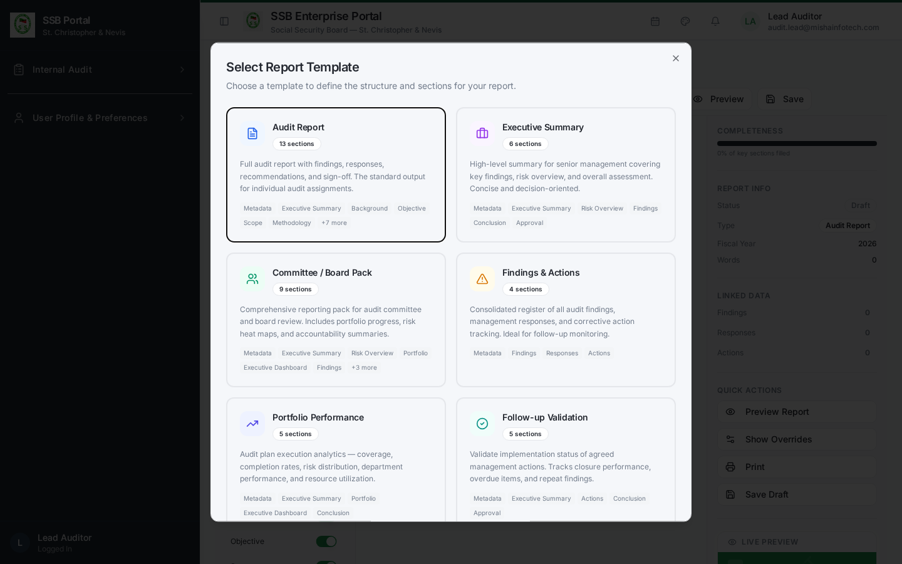
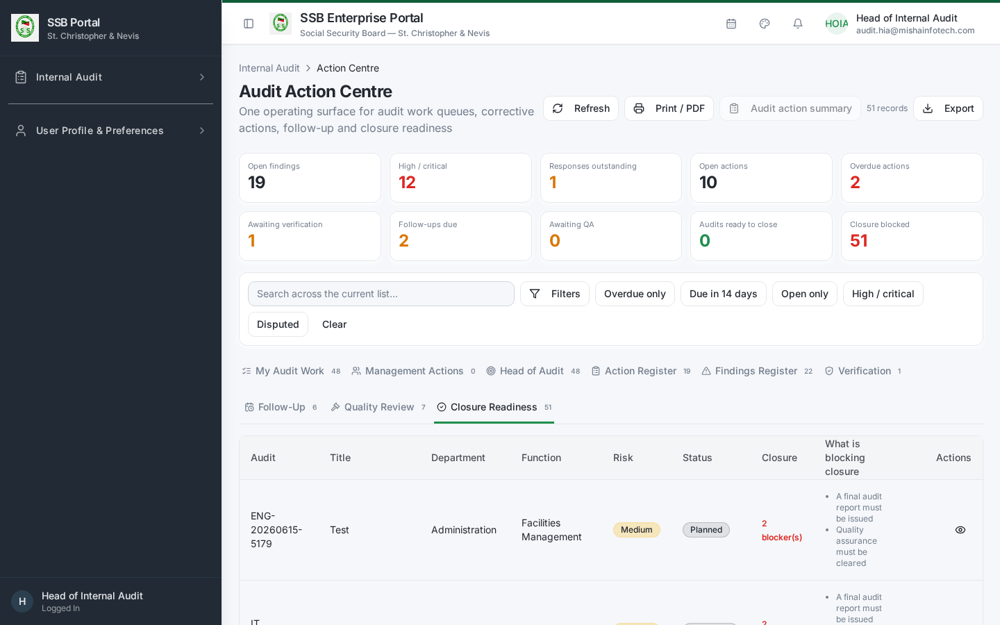

# Internal Audit — Lead Auditor Manual

**Role:** Lead Auditor (`IA_LEAD_AUDITOR`)
**Test account:** `w4-cert-lead@certification.invalid` / `audit.lead@…`
**Owns:** the engagement from launch to report issuance — preparation, programme, fieldwork
supervision, findings quality, information requests, report drafting and issuance.

---

## 1. Where your work lives

| Screen | Route | Use for |
|--------|-------|---------|
| Dashboard | `/audit/dashboard` | Your engagement portfolio at a glance |
| Audits | `/audit/audits` | The engagement list; entry point to every workspace |
| Audit workspace | `/audit/audits/:id` | All 14 engagement tabs |
| Audit Queries | `/audit/queries` | Information requests to the audited department |
| Action Centre | `/audit/action-centre` | My Audit Work, Verification, Closure Readiness |
| Report Builder | `/audit/report-builder` | Draft the audit report |
| Workload & Capacity | `/audit/workload` | Team availability |
| Time Tracking | `/audit/time-tracking` | Team time against the engagement |




> If an engagement does not appear, clear the "Approved plans" filter — engagements whose plan
> is closed or carried forward are hidden by that filter.

## 2. Launching the engagement

1. Open the engagement from **Audits**.
2. The **Overview** tab shows the lifecycle stepper, server-derived progress and the
   recommended next action.
3. **Launch Audit** appears only when you hold the launch entitlement
   (`audit_engagements:launch`) and the readiness check passes: plan approved, lead auditor and
   team assigned, planned dates set, department contactable.
4. Launch is a governed server command. If readiness fails, the panel lists the specific
   missing items — fix those and retry.
5. On launch the engagement notification is emitted to the audited department through the
   governed communication service and appears on the Timeline tab.

## 3. Preparation

**Preparation** tab:
- Confirm objectives and scope with the audited department.
- Work the preparation checklist (General / Procedure / Objective / Risk items), assigning
  items to team members.
- Upload preliminary documents supplied by the department.
- Record the kick-off meeting.

The stepper only advances to fieldwork once preparation dependencies are satisfied.



## 4. Programme / RCM

**Programme** tab — build the Risk Control Matrix for the engagement:

```text
Process  ->  Risk (likelihood x impact = inherent score)  ->  Control (preventive / detective,
frequency, owner)  ->  Test (procedure, sample basis, expected result)
```

Every test you define here becomes a testable item on the Control Tests tab. Keep the
programme aligned to the risks that justified the audit in the annual plan.



## 5. Information requests

Internal Audit → **Audit Queries** (`/audit/queries`).

1. Raise a query against the engagement with a description, required-by date and recipient.
2. The request is delivered to the department through the governed communication service;
   reminders follow automatically as the due date approaches.
3. Record the response and close the query, or escalate if it remains outstanding.



## 6. Supervising fieldwork

| Tab | What you supervise |
|-----|--------------------|
| Activities | Every planned activity has an owner and a completion date |
| Control Tests | Each test carries a Pass / Fail / Partial result with a rationale |
| Evidence | Every Fail or Partial has evidence attached |
| Working Papers | A working paper exists for each significant procedure and is reviewed |

Review each item before it is treated as complete. Reviewer sign-off is recorded on the
working paper.


## 7. Findings

**Findings** tab:
1. A finding must state condition, criteria, cause, effect and recommendation, with a severity
   of Critical / High / Medium / Low.
2. It must be linked to the activity or control test that produced it, and to its evidence.
3. Move the finding from **Draft** to **Under Review**, then to **For Management Response**.
   Only findings past Draft can be sent for a response, and Draft findings block closure.
4. Add one or more recommendations. Each recommendation can be converted into a tracked
   corrective action in one click from the Actions tab.


## 8. Management responses

**Responses** tab shows each finding's response state. You can:
- Chase an outstanding response (reminders are emitted automatically);
- Review a submitted response and accept it, or return it for clarification — the respondent
  then resubmits and the version history is preserved;
- Escalate a disputed response. A dispute is resolved by the Head of Internal Audit or an
  independent reviewer, never by you alone.


## 9. Report drafting and issuance

1. **Report Builder** (`/audit/report-builder`) assembles the report from live engagement
   data: scope, work performed, findings by severity, management responses, agreed actions
   and the overall rating.
2. Send the draft to the audited department for factual accuracy comments where your charter
   requires it.
3. **Issue** the report. Issuance is blocked while quality review is outstanding or in rework.
4. On issuance the report is archived as a generated document and distributed through the
   governed communication service with the file attached and checksum-verified.



## 10. Handover to closure

Once the report is issued and quality review is satisfactory, the engagement appears in
**Action Centre → Closure Readiness**. Clear any remaining blockers, then the Head of Internal
Audit records the closure decision on the engagement's Closure tab.



## 11. Common blockers and what they mean

| Message | Cause | Fix |
|---------|-------|-----|
| Launch readiness failed | Plan not approved, or no lead auditor / team / dates | Complete the plan entry, reassign, retry |
| Cannot send for management response | Finding still in Draft | Move the finding to Under Review first |
| Report issuance blocked | Quality review outstanding or in rework | Ask the Quality Reviewer to conclude |
| Closure blocked | Activities incomplete, Draft findings, missing responses, report not issued, QA not signed | The Closure tab lists the exact items |
