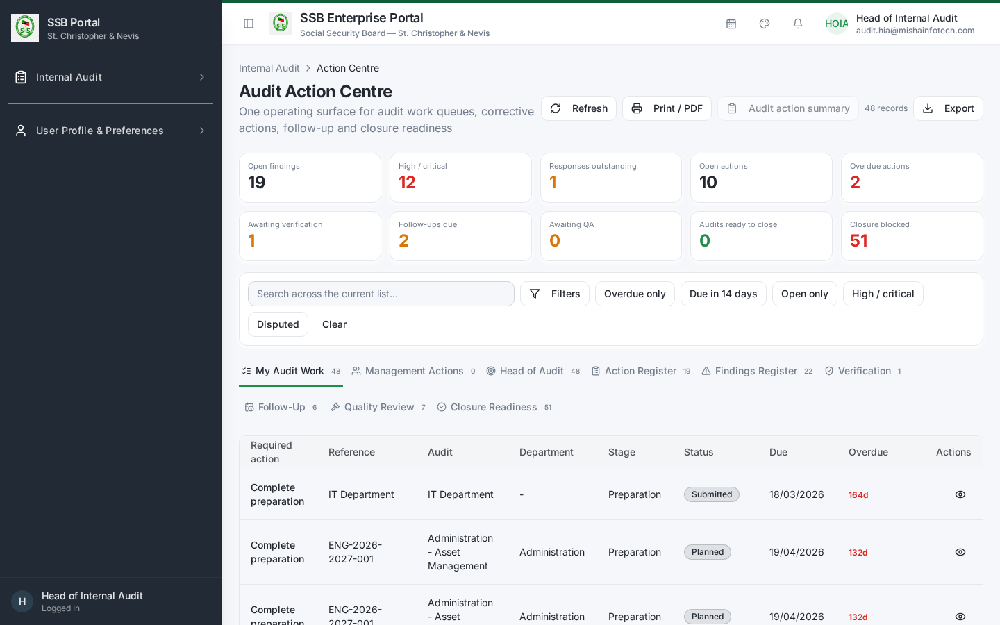
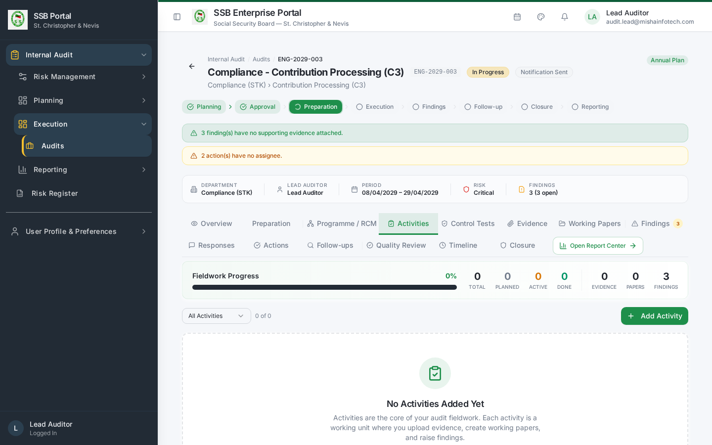
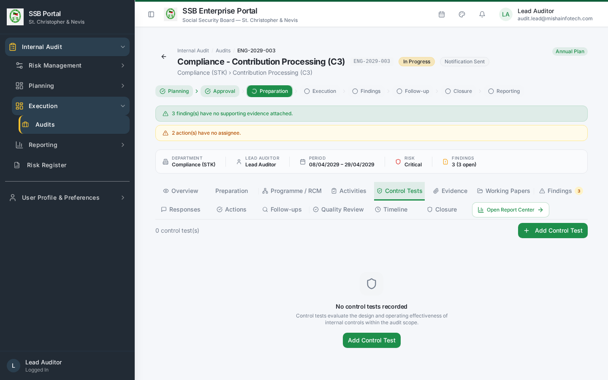
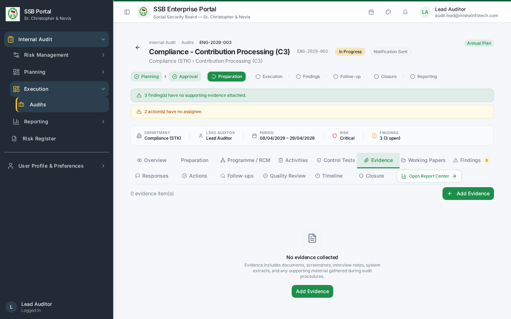
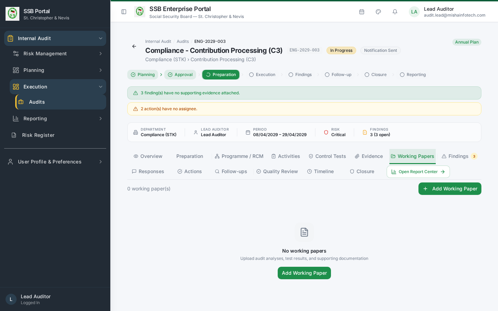
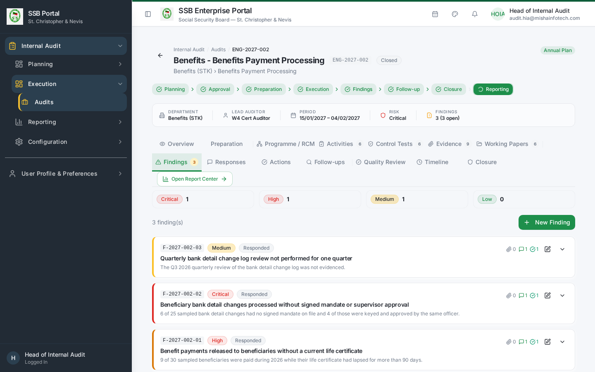
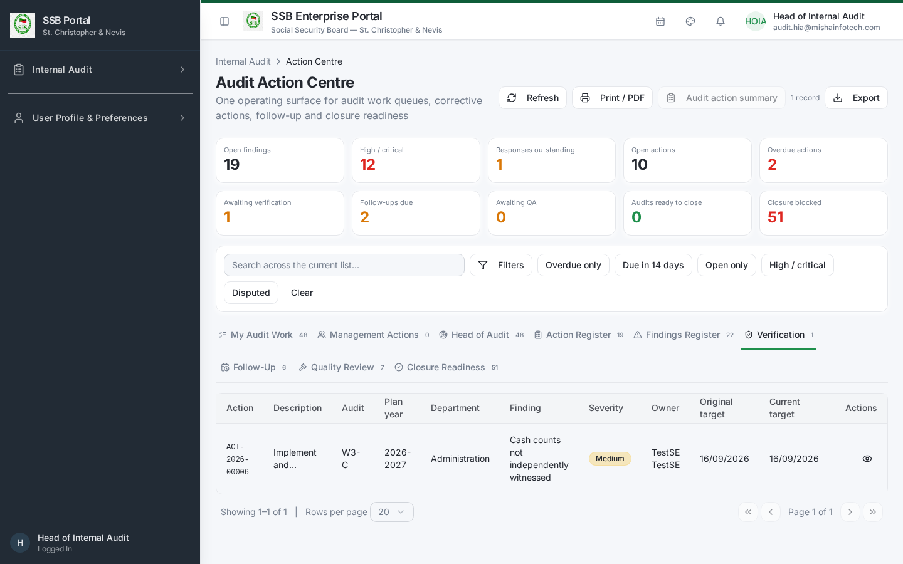
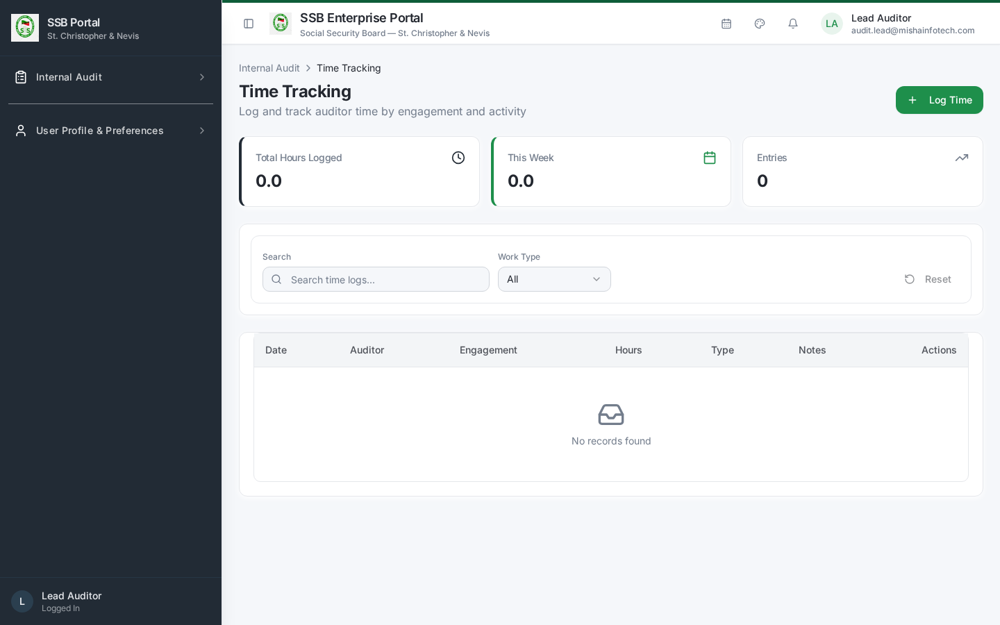

# Internal Audit — Audit Team Member Manual

**Role:** Audit Team Member / Auditor (`IA_TEAM_MEMBER`)
**Test account:** `w4-cert-auditor@certification.invalid` / `audit.auditor1@…`
**Owns:** execution — control testing, evidence, working papers, drafting findings, logging
time.

---

## 1. Start every day in the Action Centre

`/audit/action-centre` → **My Audit Work**.

The queue lists everything assigned to you across all engagements: activities to perform,
tests to execute, findings to complete, actions you own and follow-ups you must verify. Click
any row to jump straight to the right tab of the right engagement.

## 2. Opening your engagement

Internal Audit → **Audits** (`/audit/audits`) → open the engagement. Use the tabs in
lifecycle order. The Overview tab tells you which stage the engagement is at and what is
recommended next.

## 3. Performing activities

**Activities** tab:
1. Open the activity assigned to you.
2. Record what you did, the period and population covered and the sample basis.
3. Attach evidence as you go — never at the end.
4. Mark the activity **Completed** only when the work and its evidence are both in place.
   Incomplete activities block engagement closure.

## 4. Control testing

**Control Tests** tab:
1. Each test comes from the engagement's Risk Control Matrix and states the procedure and the
   expected result.
2. Record the sample tested, exceptions found, and the result: **Pass**, **Fail** or
   **Partial**.
3. A Fail or Partial requires a rationale and at least one evidence item; it is normally the
   origin of a finding.

## 5. Evidence

**Evidence** tab:
1. **Upload evidence**, then give it a clear name, a description of what it proves, and its
   source (who provided it and when).
2. Link the evidence to the activity, control test or finding it supports. Unlinked evidence
   is not part of the audit trail.
3. Evidence files are stored in the governed audit evidence store; every download is logged.

## 6. Working papers

**Working Papers** tab — one working paper per significant procedure:

| Section | What to write |
|---------|---------------|
| Objective | What the procedure was intended to establish |
| Work performed | Steps, population, sample and method |
| Results | What you observed, with references to evidence items |
| Conclusion | Whether the control objective was met |

Submit the paper for review. The Lead Auditor's review sign-off is recorded on the paper.

## 7. Raising a finding

**Findings** tab → **New Finding**:

1. **Title** — short and specific.
2. **Condition** — what is happening.
3. **Criteria** — the policy, regulation or control standard breached.
4. **Cause / root cause** — why it happened.
5. **Effect** — the exposure, quantified where possible.
6. **Severity** — Critical / High / Medium / Low.
7. **Recommendation** — one or more, each actionable and owned by a named position.
8. Link the source activity or control test and the supporting evidence.

Save as **Draft** while you work on it, then move to **Under Review** for the Lead Auditor.
Do not leave findings in Draft: Draft findings block engagement closure.

## 8. Follow-up verification

When a corrective action owner claims implementation, the item reaches
**Action Centre → Verification** (audit team only).

1. Open the action and read the owner's completion note and evidence.
2. Test independently — do not accept the owner's assertion alone.
3. Record the outcome: **Verified** (the action then closes) or **Rejected** with the reason,
   which returns the action to the owner.

## 9. Time recording

Internal Audit → **Time Tracking** (`/audit/time-tracking`). Log hours against the engagement
and activity daily. Time feeds workload, capacity planning and audit cost reporting.

## 10. What you cannot do

| Action | Who does it |
|--------|-------------|
| Launch or close an engagement | Lead Auditor / Head of Internal Audit |
| Approve a finding for issuance | Lead Auditor |
| Sign off quality review | Quality Reviewer |
| Approve or close the annual plan | Head of Internal Audit |
| Change audit configuration or risk settings | Audit Administrator |

Controls you are not entitled to use are hidden, not merely disabled.

---

## Document Control — Version History & Change Log

**Document owner:** Head of Internal Audit  **Classification:** Internal  
**Review cycle:** Annually, or on any change to the Internal Audit module.

| Version | Date | Author | Summary of change | Approval |
|---------|------|--------|-------------------|----------|
| 1.0 | 2026-08-30 | Internal Audit / Platform Team | First issued manual, generated from the live TEST environment (routes, tabs, governed commands and screenshots). | Reviewed: Lead Auditor. Approved by Head of Internal Audit on: _Pending_ |

### How to record an update
1. Add a new row at the top of the table for every content change — never edit a released row.
2. Increment the minor version (1.1, 1.2 …) for clarifications and screenshot refreshes;
   increment the major version (2.0) when a process, role or gate changes.
3. State the change in business terms (what a reader must now do differently), not file edits.
4. The manual is only "released" once the Head of Internal Audit records an approval date.
   Until then it is marked *Pending* and must not be used as certification evidence.
5. Re-export the PDF and DOCX from the Internal Audit User Manuals page after each approval.

### Change log

| Version | Change | Sections affected |
|---------|--------|-------------------|
| 1.0 | Initial release. | All |
