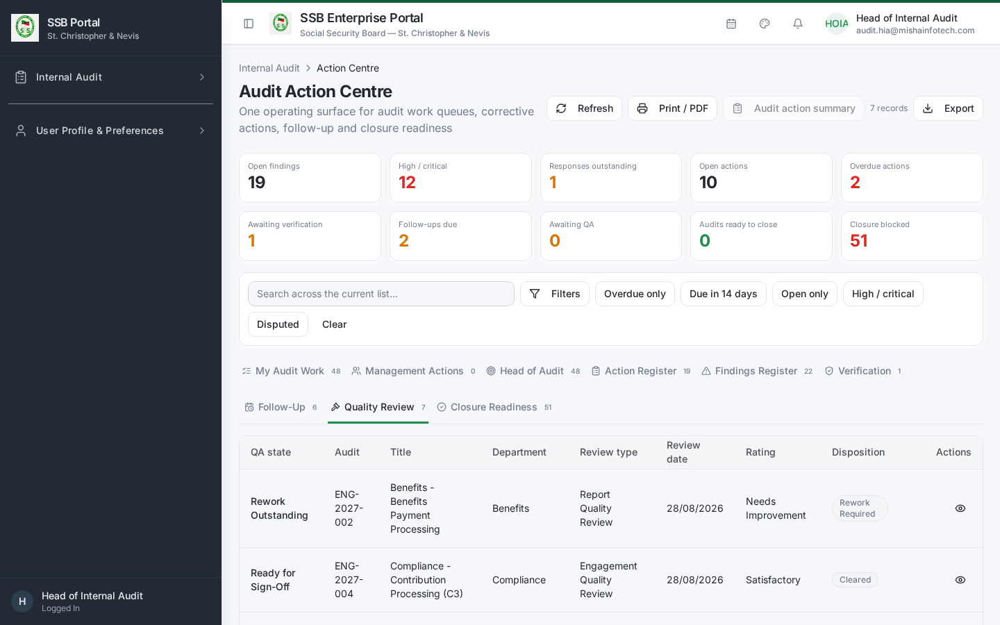
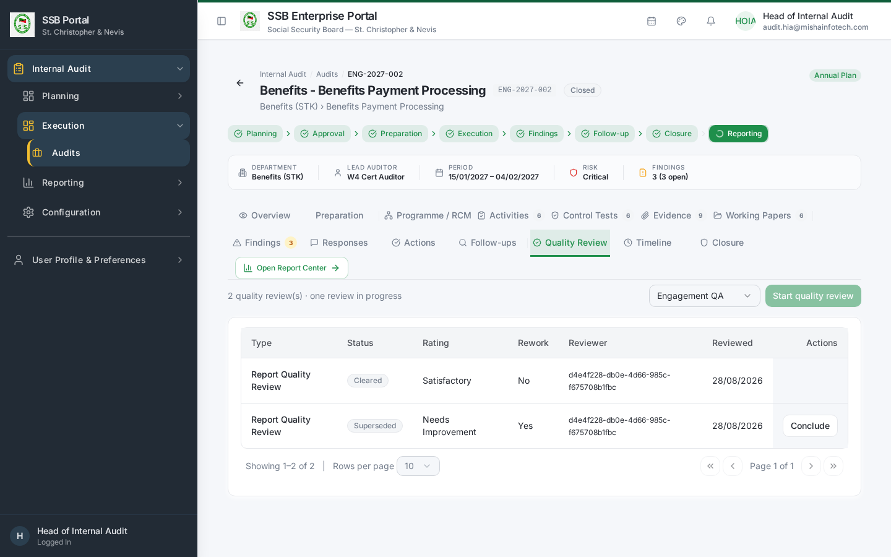

# Internal Audit — Quality Reviewer Manual

**Role:** Quality Reviewer (`IA_QUALITY_REVIEWER`)
**Test account:** `w4-cert-qa@certification.invalid` / `audit.qa@…`
**Owns:** independent quality assurance over engagements before the report is issued and
before the engagement can be closed.

---

## 1. Your access

You are scoped to the engagements on which you are named as quality reviewer. Those
engagements open in the normal workspace; you have read access to every working tab so you can
form an independent view, and write access to the **Quality Review** tab only.

| Screen | Route | Use for |
|--------|-------|---------|
| Action Centre → Quality Review | `/audit/action-centre?tab=qa` | Your review queue |
| Audit workspace → Quality Review | `/audit/audits/:id` | Perform and conclude the review |

## 2. Starting a review

1. Open the engagement from the Quality Review queue.
2. Go to the **Quality Review** tab and choose **Start Review**, selecting the review type
   (in-flight review or pre-issuance review).
3. The review record is created on the server and the engagement is flagged as under QA.

## 3. What to review

Work through the QA checklist. It covers, at minimum:

| Area | Question |
|------|----------|
| Planning | Was the engagement scoped from the approved plan and the assessed risks? |
| Preparation | Was the department notified and the scope confirmed before fieldwork? |
| Programme | Does the RCM cover the material risks, and does each test address its control? |
| Fieldwork | Is every activity complete, with sample basis and population recorded? |
| Evidence | Is each conclusion supported by linked, sourced evidence? |
| Working papers | Do they show objective, work performed, results and conclusion, and are they reviewed? |
| Findings | Do they state condition, criteria, cause, effect and recommendation, with a defensible severity? |
| Responses | Does every finding have a management response, and are disputes properly escalated? |
| Report | Does the report reflect the findings and the agreed actions, with a supported overall rating? |
| Independence | Were segregation-of-duties requirements met, and are any exceptions logged? |

Record a result and a note against each checklist item. Notes are part of the permanent
record.

## 4. Concluding the review

Choose one outcome:

| Outcome | Effect |
|---------|--------|
| **Satisfactory** | QA is signed off. The Lead Auditor can issue the report; closure is unblocked on this criterion. |
| **Rework required** | The engagement returns to the audit team with your specific rework points. Report issuance is blocked until you re-review and conclude Satisfactory. |

Set the quality rating, add your conclusion, and sign off. The sign-off records your identity
and timestamp and cannot be edited afterwards — a later change requires a new review.

## 5. Independence and segregation of duties

- You must not have performed fieldwork on the engagement you review.
- If the Head of Internal Audit is both approver and quality reviewer (a small-shop
  situation), the system records a logged SoD exception on the sign-off. It does not silently
  allow it, and the exception is visible in the audit trail and the certification reports.

## 6. Gates you enforce

| Gate | Enforced where |
|------|----------------|
| No report issuance while QA is outstanding or in rework | Server-side, on the issuance command |
| No engagement closure without a signed-off quality review | Server-side, in the closure evaluation |

If either gate fires, the screen names the missing quality review rather than showing a
generic error.

---

## Document Control — Version History & Change Log

**Document owner:** Head of Internal Audit  **Classification:** Internal  
**Review cycle:** Annually, or on any change to the Internal Audit module.

| Version | Date | Author | Summary of change | Approval |
|---------|------|--------|-------------------|----------|
| 1.0 | 2026-08-30 | Internal Audit / Platform Team | First issued manual, generated from the live TEST environment (routes, tabs, governed commands and screenshots). | Reviewed: Lead Auditor. Approved by Head of Internal Audit on: _Pending_ |

### How to record an update
1. Add a new row at the top of the table for every content change — never edit a released row.
2. Increment the minor version (1.1, 1.2 …) for clarifications and screenshot refreshes;
   increment the major version (2.0) when a process, role or gate changes.
3. State the change in business terms (what a reader must now do differently), not file edits.
4. The manual is only "released" once the Head of Internal Audit records an approval date.
   Until then it is marked *Pending* and must not be used as certification evidence.
5. Re-export the PDF and DOCX from the Internal Audit User Manuals page after each approval.

### Change log

| Version | Change | Sections affected |
|---------|--------|-------------------|
| 1.0 | Initial release. | All |
