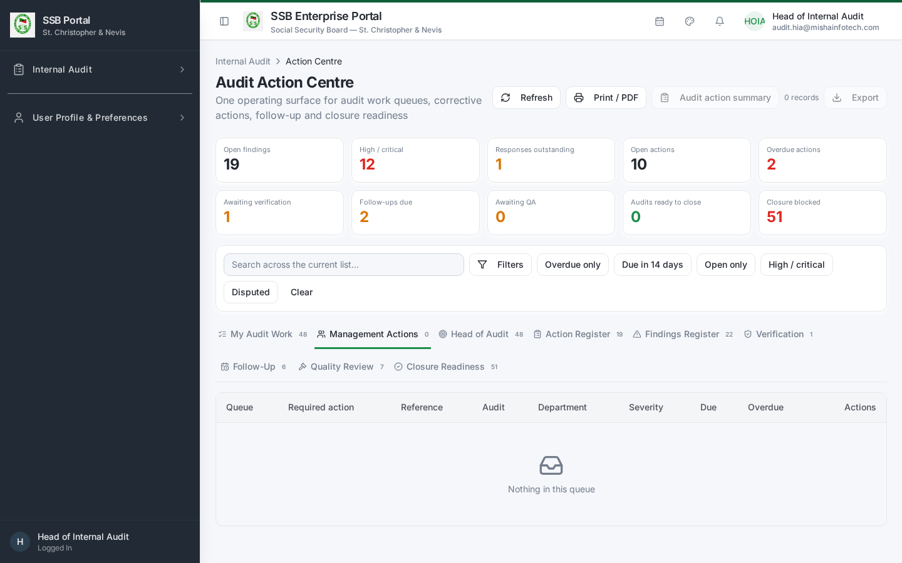
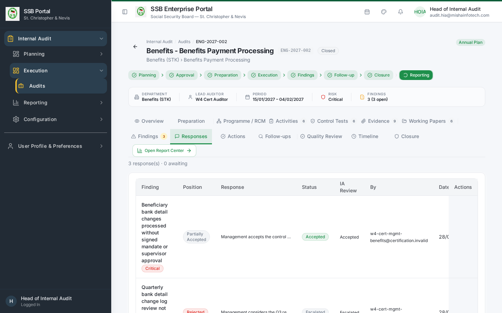
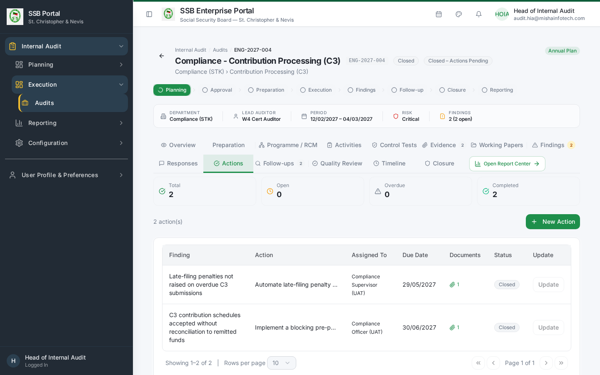
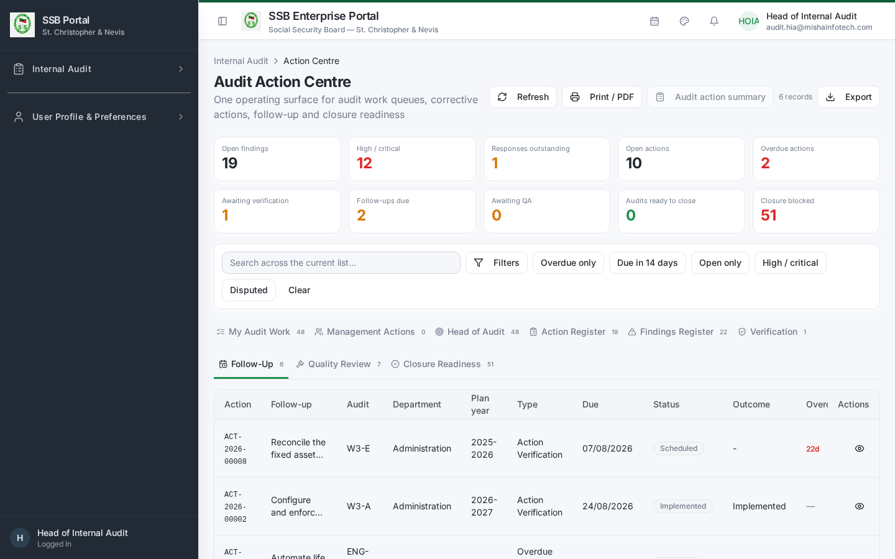
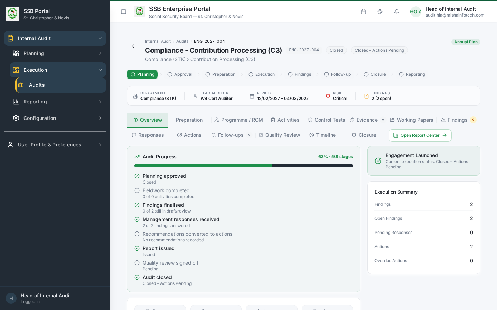

# Internal Audit — Management Respondent Manual

**Role:** Management Respondent (`IA_MANAGEMENT_RESPONDENT`)
**Test accounts:** `w4-cert-mgmt-benefits@certification.invalid`,
`audit.mgmt.benefits@…`, `audit.mgmt.compliance@…`, `audit.mgmt.finance@…`
**Owns:** your department's response to audit findings, the corrective actions arising, and
the evidence that they were implemented.

You are not an auditor. Your screens are deliberately limited to your own queues, and you see
only findings and actions belonging to your department.

---

## 1. Your workspace

Sidebar → **Internal Audit → Management Workspace**:

| Entry | Route | Purpose |
|-------|-------|---------|
| My Work | `/audit/action-centre?tab=management` | Everything owed by you, oldest first |
| Findings Register | `/audit/action-centre?tab=findings` | Findings raised against your department |
| Corrective Actions | `/audit/action-centre?tab=register` | Actions you own, with target dates |
| Follow-Ups | `/audit/action-centre?tab=followup` | Scheduled verification of your actions |

Auditor-only surfaces — Head of Audit, Verification, Quality Review, Closure Readiness — are
not shown to you.

## 2. Notifications you will receive

All audit communications reach you by email and as in-app notifications:

| Event | When |
|-------|------|
| Engagement notification | An audit of your department is launched |
| Information request | The audit team needs documents or data, with a required-by date |
| Response required | A finding has been sent to you for a management response |
| Response reminder | The response deadline is approaching |
| Action due soon / overdue | A corrective action you own is approaching or past its target date |
| Escalation | An overdue action is escalated to your senior management |
| Report issued | The final audit report for your department is available |

## 3. Responding to a finding

1. Open **My Work** and select the finding.
2. Read the condition, criteria, cause, effect and the recommendation, and inspect the linked
   evidence.
3. Choose your management position:

| Position | Meaning | What is required |
|----------|---------|------------------|
| **Accepted** | You agree with the finding and the recommendation | An action plan, owner and target date |
| **Partially accepted** | You agree in part | State precisely what you accept and what you do not, plus an action plan for the accepted part |
| **Rejected / Disagree** | You do not accept the finding | A written rationale with supporting facts. The finding is retained and the disagreement is recorded in the report; the Head of Internal Audit resolves the dispute. |

4. Enter the response text, the action plan, the responsible person and the target date, then
   submit.
5. The response is versioned. If the audit team returns it for clarification, you edit and
   resubmit — the previous version stays in the record.

## 4. Working a corrective action

1. Open **Corrective Actions** and select the action.
2. Move it through its lifecycle as work progresses:
   **Open → In Progress → Completed (submitted for verification)**.
3. When you submit completion, add a completion note and attach the evidence proving the
   action was implemented. Evidence is mandatory — a claim without evidence is rejected at
   verification.
4. You cannot close an action yourself. Internal Audit verifies independently and closes it.

### Needing more time
Use **Request extension** on the action, with a reason and a proposed new target date. The
extension must be decided by Internal Audit; the original target date and the decision are
both retained. Do not simply let an action go overdue — overdue high and critical actions are
escalated automatically.

## 5. Follow-ups

The **Follow-Ups** tab shows when Internal Audit will verify your implemented actions. Have
the evidence in place before the follow-up date. If verification fails, the action returns to
you with the reason and a revised date.

## 6. After the audit closes

An engagement can close as **Closed – Actions Pending**. That does not release you: your open
actions stay in your queue, keep emitting reminders, and remain subject to verification and
escalation until they are verified and closed.

## 7. Quick answers

| Question | Answer |
|----------|--------|
| Can I edit a finding? | No. You can dispute it in your response. |
| Can I close my own action? | No. Internal Audit verifies and closes it. |
| Can I see another department's findings? | No. Your view is scoped to your department. |
| Where do I upload evidence? | On the action itself, when submitting completion. |
| Who resolves a dispute? | The Head of Internal Audit or an independent reviewer. |
