# Internal Audit — Audit Administrator Manual

**Role:** Audit Administrator (`IA_AUDIT_ADMIN`, usually held alongside Head of Internal Audit)
**Owns:** master data, risk configuration, module settings, document and communication
templates, escalation roles and auditor resources.

Configuration drives behaviour everywhere else in the module. Set it up in the order below —
later steps depend on earlier ones.

---

## 1. Golden path — set-up order

| # | Step | Screen |
|---|------|--------|
| 1 | Audit configuration and feature flags | `/audit/config` |
| 2 | Departments (audit universe) | `/audit/departments` |
| 3 | Business functions per department | `/audit/functions` |
| 4 | Auditor profiles | `/audit/auditors` |
| 5 | Risk configuration (scales, weights, thresholds) | `/audit/risk-settings` |
| 6 | Risk assessments and register | `/audit/risk-assessment`, `/audit/risk-register` |
| 7 | Escalation roles and SLA / notification rules | `/audit/escalation-roles`, `/audit/config` |
| 8 | Document and output settings | `/audit/document-templates` |
| 9 | Communication templates | `/audit/templates` |
| 10 | First annual plan | `/audit/audit-plans` |

## 2. Departments and business functions

**Departments** (`/audit/departments`) links the organisation's departments into the audit
universe: office, head of department (a real profile), contact email and phone, status and
the derived risk rating. This is the only department list the module uses — the Risk Register
and every engagement read from it.

**Business Functions** (`/audit/functions`) records the functions inside each department, each
with a risk level. Functions are the unit that is risk-assessed and put in scope on an
engagement.

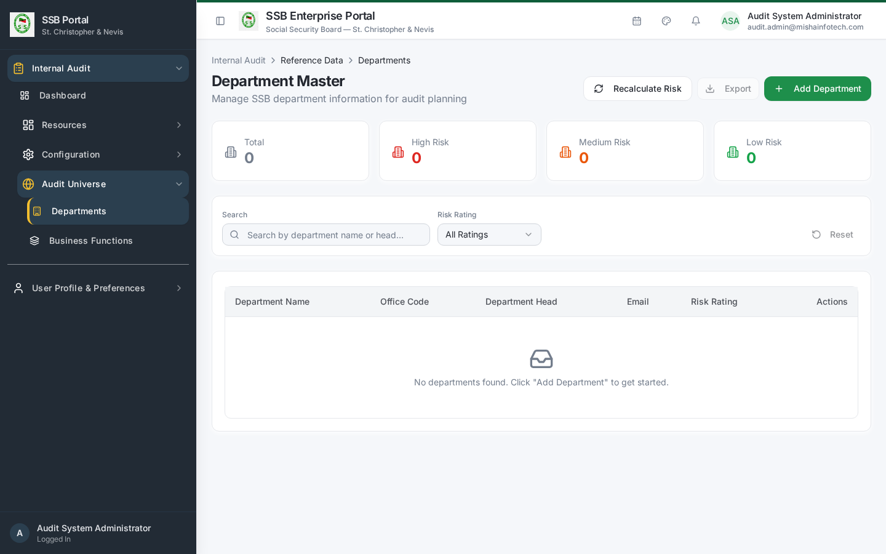
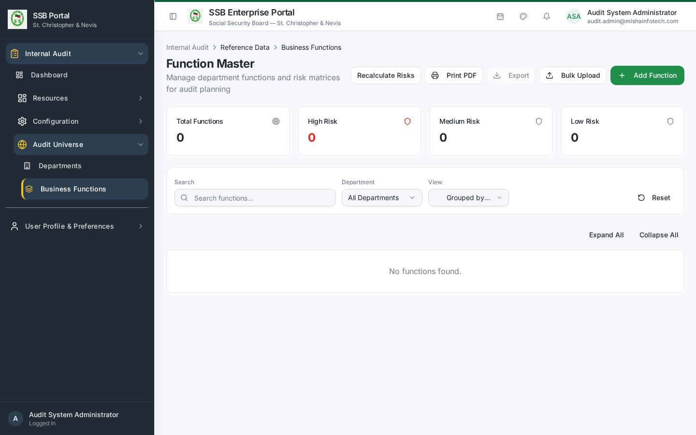

## 3. Risk configuration

`/audit/risk-settings` defines the scoring model used everywhere:

| Setting | Effect |
|---------|--------|
| Likelihood levels (1–5) | The vertical axis of the risk matrix |
| Impact levels (1–5) | The horizontal axis |
| Risk criteria and weights | How factor scores combine into a risk score |
| Classification thresholds | Score bands for Low / Medium / High / Critical |
| Control effectiveness levels | The percentage by which effective controls reduce inherent risk |
| Audit frequency by risk band | How often an entity should be audited — feeds plan proposals |

Changing thresholds re-classifies existing entities the next time they are assessed; it does
not rewrite historical assessments.

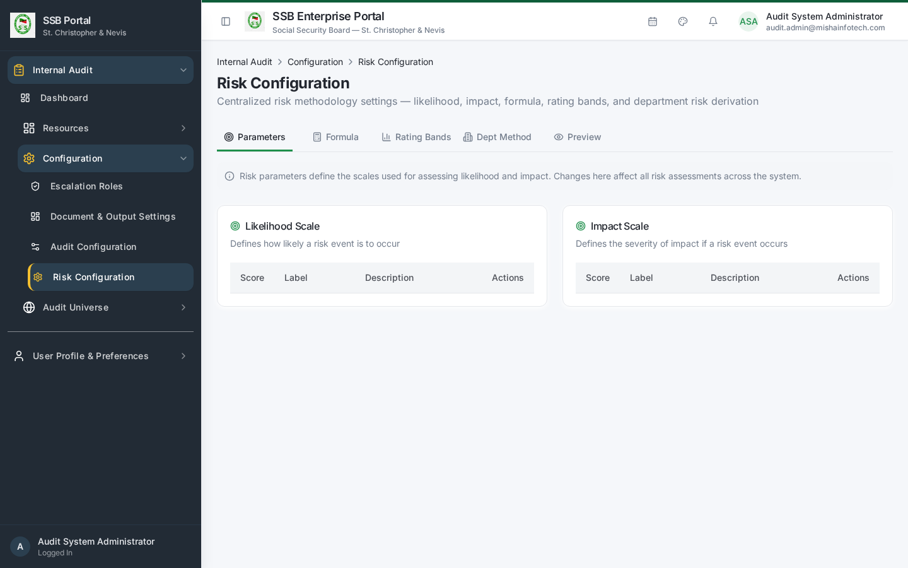

## 4. Risk assessment and register

- **Risk Assessment** (`/audit/risk-assessment`) — score each function against the configured
  criteria. Saving an assessment synchronises the department's risk rating.
- **Entity Risk Summary** (`/audit/entity-summary`) — consolidated position per entity.
- **Risk Matrix** (`/audit/risk-matrix`) — the heat map presented to the audit committee.
- **Risk Register** (`/audit/risk-register`) — the standing register, keyed on department and
  business function.

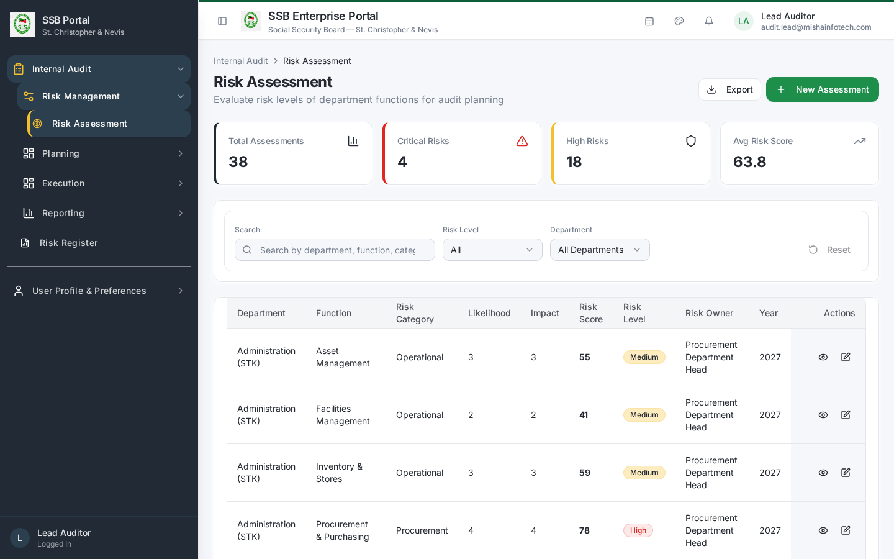
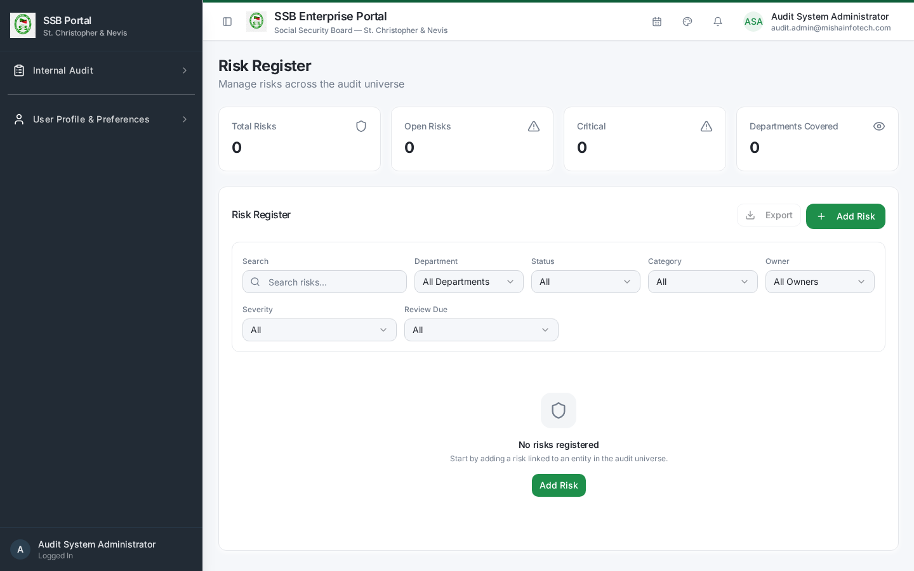

## 5. Module configuration

`/audit/config` groups the operational settings:

| Section | Controls |
|---------|----------|
| Planning engine | Audit frequency defaults, planning horizon, capacity assumptions, the Revise-Plan guard (Block / Warn / Allow) |
| Approvals | Which lifecycle steps need approval and by which role |
| Activity types | The catalogue of fieldwork activity types |
| Notifications & SLA | Response deadlines, reminder lead times (for example 7 / 3 / 1 day), overdue escalation intervals |
| Reference settings | Severity labels, ratings, dispositions |
| Feature flags | Which optional Internal Audit surfaces are enabled |

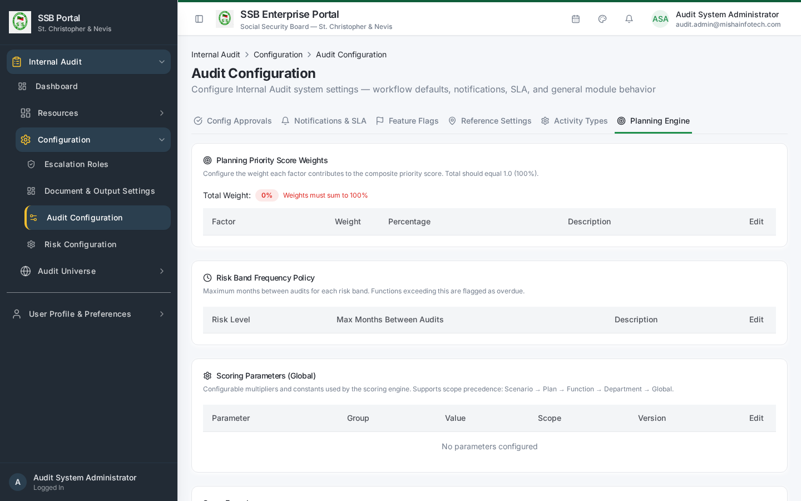
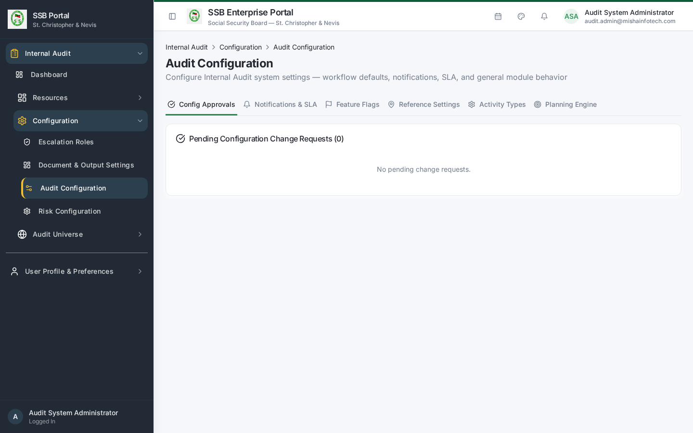
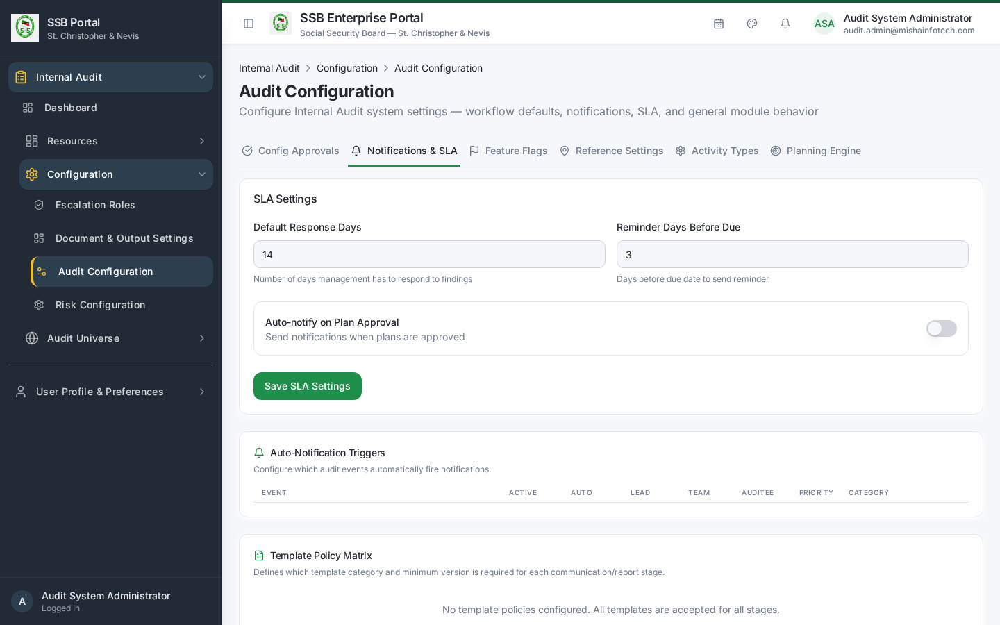
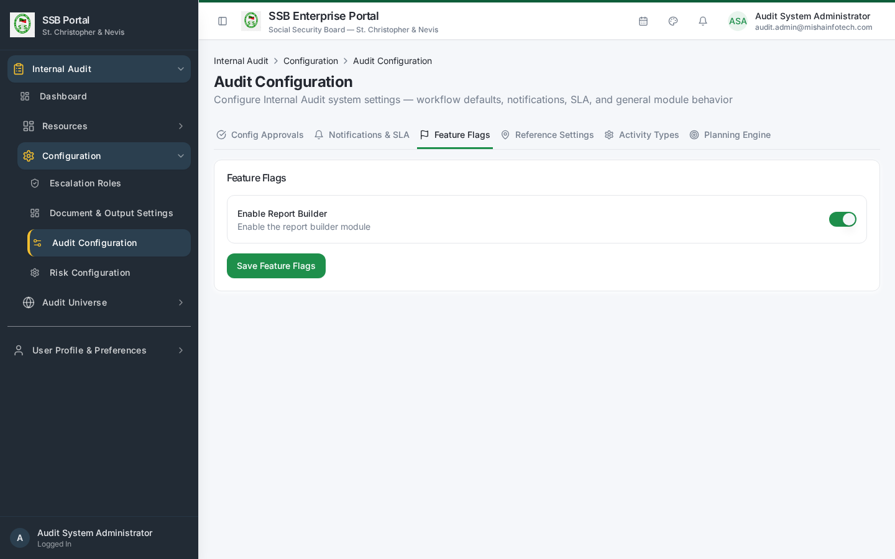

## 6. Escalation roles

`/audit/escalation-roles` maps each escalation level to a real office holder — for example
overdue action → department head → director → Head of Internal Audit. Escalation
notifications resolve their recipients from this register, so keep it current when people
change roles.

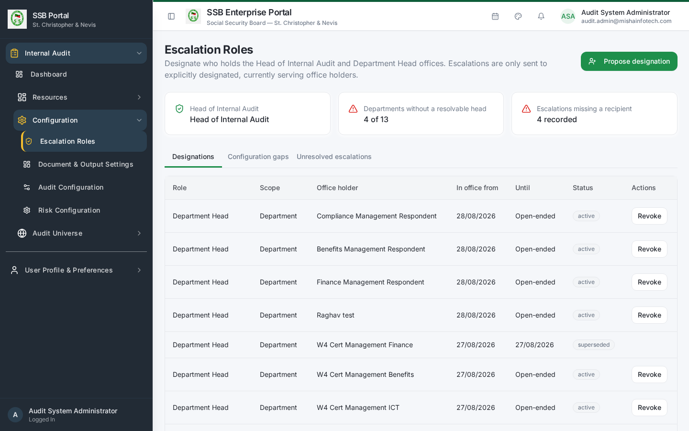

## 7. Documents and communications

- **Document & Output Settings** (`/audit/document-templates`) — letterhead, signature blocks,
  footers and disclaimers used on generated audit letters and reports, and the numbering
  format for engagements, findings and actions.
- **Communication Templates** (`/audit/templates`) — opens the platform's Core Template
  Designer filtered to the AUDIT module. Every Internal Audit notification is a catalogued
  event with published Email and In-App template versions. Edit content there; never create a
  parallel audit-only mail or SMS mechanism.

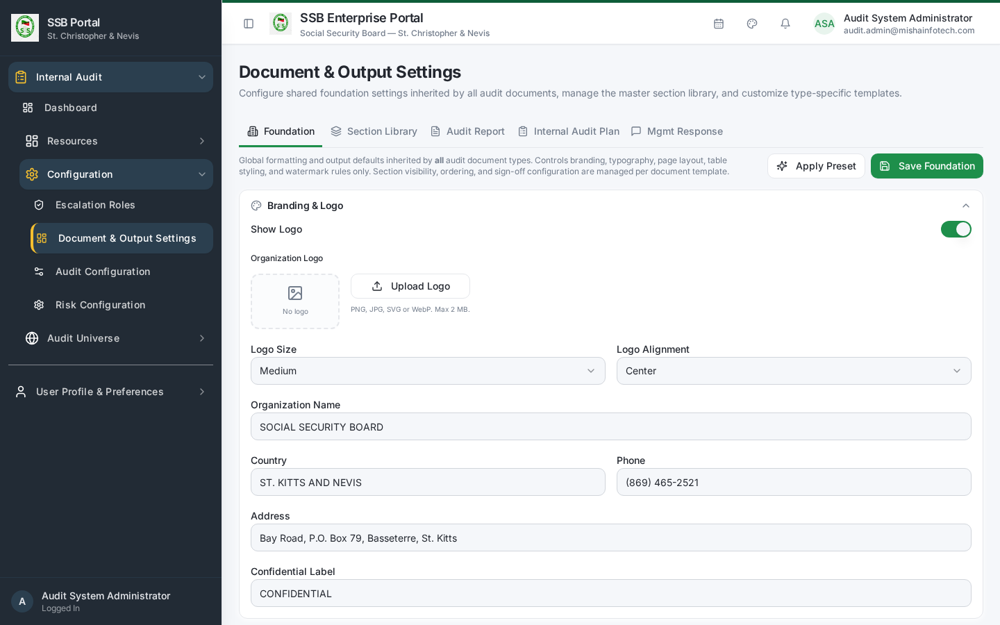
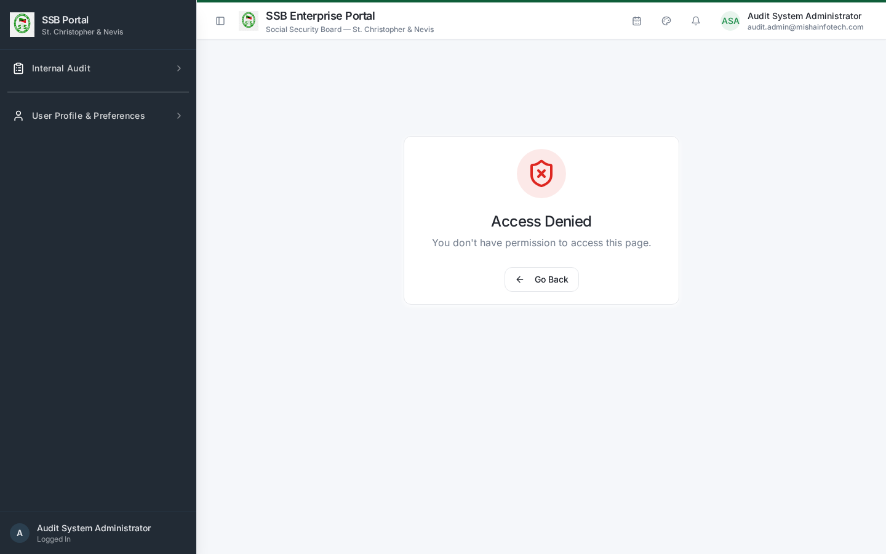

## 8. Auditor resources

| Screen | Purpose |
|--------|---------|
| Auditor Profiles (`/audit/auditors`) | Link a platform profile to an auditor record with specialisation, qualification and status. **A person only counts as audit team once they have an auditor profile** — this is what separates auditors from management respondents. |
| Workload & Capacity (`/audit/workload`) | Available days per auditor against planned engagement days |
| Auditor Leave (`/audit/leave`) | Leave and vacation, subtracted from capacity |
| Time Tracking (`/audit/time-tracking`) | Actual hours per engagement and activity |

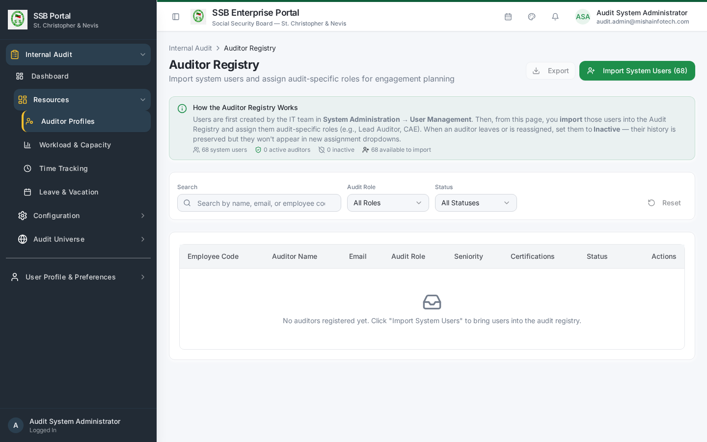
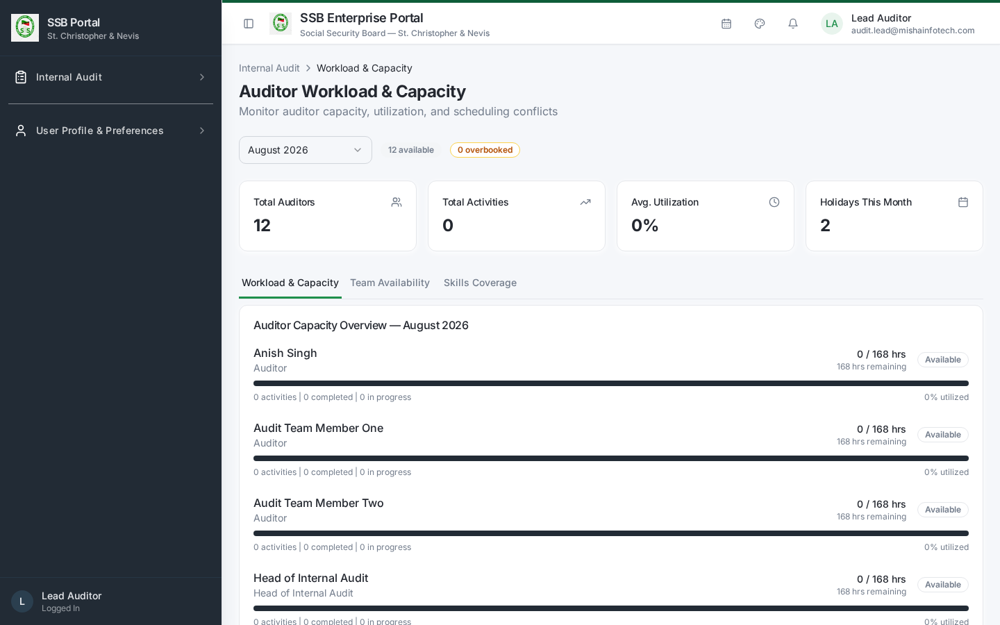
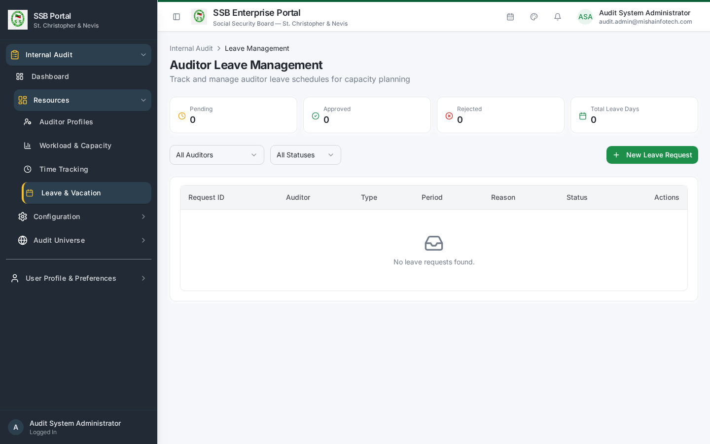

## 9. Roles and permissions

The five Internal Audit roles and the entitlements behind each screen are administered in the
platform's Role & Permission screens. The key registry actions are:

| Module | Actions |
|--------|---------|
| `internal_audit` | `view` |
| `audit_plans` | `create`, `edit`, `submit` |
| `plan_approval` | `approve`, `reject` |
| `audit_engagements` | `create`, `edit`, `assign`, `launch`, `close` |
| `activity_workbench`, `control_testing` | `execute` |
| `evidence_management`, `working_papers` | `create`, `edit` |
| `findings_recommendations` | `create`, `edit`, `approve` |
| `management_responses` | `create`, `edit` |
| `action_tracking` | `create`, `edit`, `close` |
| `follow_up_tracker` | `create`, `edit`, `close` |
| `audit_report_center` | `create`, `issue` |
| `quality_review` | `create`, `approve` |
| `plan_closeout` | `approve`, `close` |
| `audit_configuration` | `configure` |
| `audit_risk_configuration` | `view`, `edit`, `configure` |
| `risk_register`, `risk_assessment` | `create`, `edit` |

Grant these to the five roles — Head of Internal Audit, Lead Auditor, Audit Team Member,
Quality Reviewer, Management Respondent — rather than to individuals.

## 10. Administrator health checks

| Frequency | Check |
|-----------|-------|
| Weekly | Communication Compliance report — every required audit notification delivered |
| Monthly | Auditor profiles and escalation roles still match the org chart |
| Quarterly | Risk configuration still matches the approved methodology |
| Annually | Audit universe refresh: new departments and functions added before planning starts |

---

## Document Control — Version History & Change Log

**Document owner:** Head of Internal Audit  **Classification:** Internal  
**Review cycle:** Annually, or on any change to the Internal Audit module.

| Version | Date | Author | Summary of change | Approval |
|---------|------|--------|-------------------|----------|
| 1.0 | 2026-08-30 | Internal Audit / Platform Team | First issued manual, generated from the live TEST environment (routes, tabs, governed commands and screenshots). | Reviewed: Lead Auditor. Approved by Head of Internal Audit on: _Pending_ |

### How to record an update
1. Add a new row at the top of the table for every content change — never edit a released row.
2. Increment the minor version (1.1, 1.2 …) for clarifications and screenshot refreshes;
   increment the major version (2.0) when a process, role or gate changes.
3. State the change in business terms (what a reader must now do differently), not file edits.
4. The manual is only "released" once the Head of Internal Audit records an approval date.
   Until then it is marked *Pending* and must not be used as certification evidence.
5. Re-export the PDF and DOCX from the Internal Audit User Manuals page after each approval.

### Change log

| Version | Change | Sections affected |
|---------|--------|-------------------|
| 1.0 | Initial release. | All |
