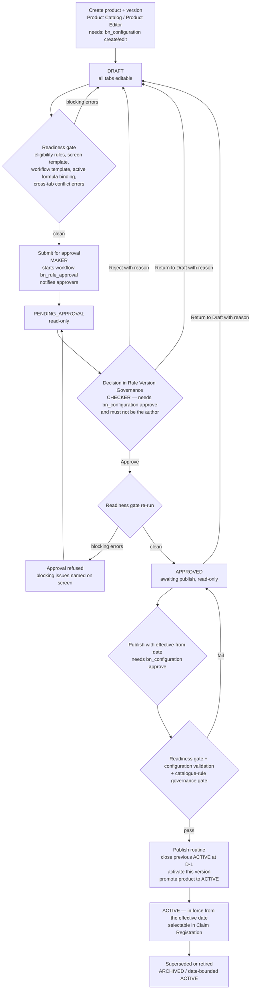
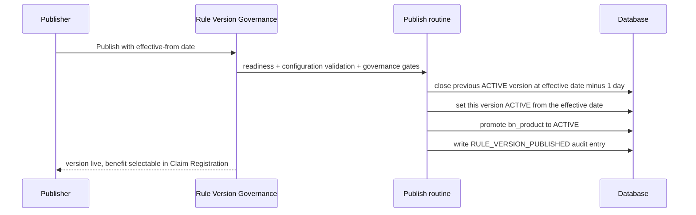

# Benefit Product Version — Creation, Approval and Publication

Audience: business owners, configuration administrators, testers.
Screens: **Product Catalog / Product Editor** (`/bn/config/products`) and
**Rule Version Governance** (`/bn/config/rules-admin`).

---

## 1. Lifecycle at a glance

---

## 2. Who does what

| Step | Screen | Right required | Typical roles |
|---|---|---|---|
| View products and versions | Product Catalog, Governance | `bn_configuration` → view | Admin, BN_CONFIG_ADMIN, BN_AUDITOR (read-only) |
| Create / edit a draft version, edit rules | Product Editor | `bn_configuration` → create / edit | Admin, BN_CONFIG_ADMIN |
| Submit for approval | Product Editor or Governance | `bn_configuration` → edit | Admin, BN_CONFIG_ADMIN |
| Approve / Reject | Governance | `bn_configuration` → **approve** | Admin, BN_CONFIG_ADMIN |
| Return to Draft (unlock for fixing) | Governance | `bn_configuration` → edit | Admin, BN_CONFIG_ADMIN |
| Publish and activate | Governance | `bn_configuration` → **approve** | Admin, BN_CONFIG_ADMIN |

**Maker-checker.** The approver must not be the person recorded as the version's
author. Approving your own submission is refused with
*"Maker-checker violation: approver cannot be the same as the author"* — even if
you hold the approve right.

**Approve is a separate right.** Holding edit lets a user author and submit only.
Users without the approve right see the versions read-only, with an
*Awaiting approver* / *Awaiting publisher* marker instead of decision buttons, and
the service refuses the action if it is called another way.

---

## 3. The readiness gate

The same gate runs at **submit**, **approve** and **publish**, so a version can
never reach APPROVED in a state publish would later refuse. It blocks on:

- no eligibility rules on the version;
- no screen (intake) template mapped;
- no workflow template mapped;
- no active calculation/formula binding;
- any ERROR-level cross-tab conflict from Conflict Detection.

Each blocking item is named on screen. Governance shows a **Readiness** column per
row (*Ready to publish* or *N blocking issues*), and the issue text links straight
to the Product Editor for that version. INFO-level findings (for example missing
optional letter mappings) never block.

**Stuck version?** Use **Return to Draft** with a reason. That unlocks the version
for editing (every Product Editor tab is read-only outside DRAFT). ACTIVE versions
are deliberately excluded — a live version is cloned to a new draft instead of
being edited in place.

---

## 4. What publishing actually does

Only one version applies to any given date. More than one row may carry status
ACTIVE when their effective periods do not overlap — this preserves history so a
back-dated claim resolves against the rules in force on its claim date.

---

## 5. Audit trail

Every transition writes a critical audit entry against `bn_product_version`:

| Action | Audit event | Captured |
|---|---|---|
| Submit | `RULE_VERSION_SUBMITTED` | from/to status, workflow instance |
| Approve | `RULE_VERSION_APPROVED` | approver, comments |
| Reject | `RULE_VERSION_REJECTED` | rejector, reason (also appended to the version description) |
| Return to Draft | `RULE_VERSION_RETURNED_TO_DRAFT` | user, previous status, reason |
| Publish | `RULE_VERSION_PUBLISHED` | publisher, effective date, product, version number |

---

## 6. Test checklist

1. **Author-only user** (edit, no approve): can create, edit and submit a draft;
   Governance shows the banner *Read-only governance access* and no
   Approve / Reject / Publish buttons.
2. **Approver approving own work**: blocked by maker-checker with the explicit message.
3. **Second approver**: approves a clean version → status **Approved**; publishes with an
   effective date → status **Active**, previous version **Archived** with effective-to at
   D-1, product shows **Active** in Product Catalog.
4. **Version with blocking issues**: Approve/Publish disabled, Readiness column names the
   issues, **Return to Draft & Fix** unlocks it for correction.
5. **Claim Registration**: the freshly published benefit is selectable and resolves to the
   new version for a claim date on or after the effective-from date.
