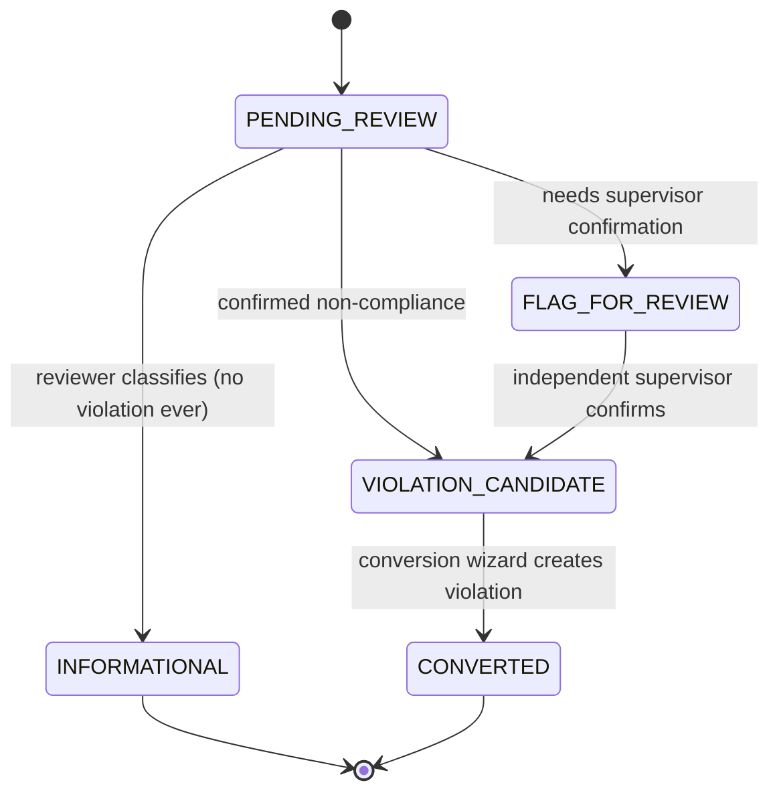
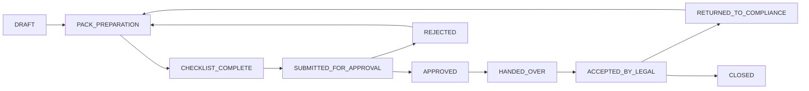
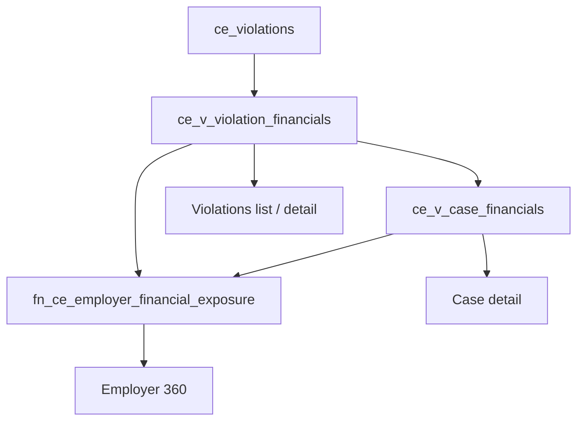

# Release Notes & Tester Guide — 23 August 2026
## Compliance & Enforcement: Data Integrity, Legal Escalation, Inspection Workflow

Audience: manual testers / UAT personas.
Scope of this release: three work packages (Prompt 1, Prompt 2, Prompt 3) delivered on the Compliance & Enforcement module. No changes were made to Benefits, Omni-Comms or Finance in this release.

---

## 1. What changed (summary)

| # | Area | What was wrong | What was delivered |
|---|------|----------------|--------------------|
| 1 | Violation & case financials | Violation amounts on list, detail, case and Employer 360 disagreed; employer exposure double-counted | Single authoritative read model (`ce_v_violation_financials`, `ce_v_case_financials`, `fn_ce_employer_financial_exposure`); all screens now read one service |
| 2 | Violation routing | Large volume of violations had no owner/queue | 122,110 violations routed via backfill; partial index added (query 9.15s → 252ms) |
| 3 | Violation status workflow | Backward/illegal status jumps possible from UI | Database transition guard, driven by workflow configuration (not hardcoded) |
| 4 | Compliance → Legal escalation | "Quick Forward" skipped preparation stages; duplicate Legal actions | 9-stage referral lifecycle with DB guard, maker-checker, ownership rules; Quick Forward removed |
| 5 | Legal pack preparation | Handoff possible with incomplete pack | Mandatory handoff checklist before referral can be accepted by Legal |
| 6 | Payment arrangements | Action disabled with no explanation | Eligibility evaluator with human-readable reasons; concurrent-arrangement protection |
| 7 | Waivers | Non-functional | Waivers tab on case detail; principal-contribution waivers blocked by DB guard |
| 8 | Case merge | Raw UUIDs shown; merged data left behind | Readable case references; merge relocates violations and notices; self-merge/duplicate merge blocked |
| 9 | Inspection navigation | Wrong menu highlighted after plan submission; Field vs Inspection duplication | Consolidated under `/compliance/field/*`; correct active-menu context |
| 10 | Findings page | "Field Inspection Findings temporarily unavailable" | Crash fixed (unsafe dates + oversized query); global findings view added |
| 11 | Finding → Violation conversion | Button existed but did nothing | Policy-driven conversion with disposition lifecycle, traceability and duplicate prevention |
| 12 | Feature toggles | Some inspection routes stayed visible when toggle OFF | Toggle filter now covers inspections and operations routes |

---

## 2. Key concepts testers must understand

### 2.1 Finding disposition lifecycle

Every inspection finding now carries a **disposition**. A finding can only become a violation through this path.

### 2.2 Where the conversion policy comes from

Behaviour is **configuration**, not code. It is read from the Violation Type record (`ce_violation_types`):

| Field | Effect |
|-------|--------|
| `conversion_policy = DIRECT` | Authorised officer may convert straight away |
| `conversion_policy = REVIEW_REQUIRED` | Finding must first be confirmed as VIOLATION_CANDIDATE |
| `conversion_policy = INFORMATIONAL_ONLY` | Findings of this type can never become violations |
| `requires_supervisor_review` | Supervisor confirmation required |
| `maker_checker_required` | The confirmer must be a different user from the finding author |
| `inspection_eligible` | Whether the type may be selected from an inspection finding at all |

### 2.3 Compliance → Legal referral lifecycle

Rules enforced in the database (not just the UI):
- Stages cannot be skipped or reversed except on the paths above.
- The user who submits for approval cannot approve it (maker-checker).
- Only Legal-owned roles can move a referral to `ACCEPTED_BY_LEGAL`, `RETURNED_TO_COMPLIANCE` or `CLOSED`.
- The old "Quick Forward to Legal" shortcut no longer exists.

### 2.4 Financial read model

All four surfaces must show the **same numbers**. Employer 360 exposure must not double-count a violation that is also inside a case.

---

## 3. Manual test plan — what to check, where, how

### TC-01 Violation amount consistency
- Where: Compliance → Violations → open any violation with a linked case; then Employer 360 for the same employer; then the case in Case Management.
- Check: assessed / penalty / interest / outstanding amounts identical across Violations list row, Violation detail, Case detail and Employer 360.
- Expected: identical to the cent. Employer 360 exposure = sum of case exposure + uncased violations only (no double count).

### TC-02 Violation status transitions
- Where: Violation detail → workflow actions.
- Check: only forward actions allowed by workflow configuration appear.
- Try: an illegal/backward move (if a tool or a second tab allows it) → expected rejection with a clear message, not a silent save.

### TC-03 Legal escalation — happy path
- Where: Case detail → Legal / Escalation.
- Steps: create referral (DRAFT) → prepare pack → complete handoff checklist → submit for approval → sign in as a **different** user with approval rights → approve → hand over → sign in as Legal persona → accept.
- Expected: each stage recorded with actor and timestamp; no stage can be skipped; "Quick Forward" button is absent everywhere.

### TC-04 Legal escalation — maker-checker
- Steps: the same user who submitted tries to approve.
- Expected: blocked with an explicit maker-checker message; attempt is auditable.

### TC-05 Legal pack checklist
- Where: Legal Pack Preparation page.
- Expected: referral cannot advance while any mandatory checklist item is unticked; missing items are named.

### TC-06 Payment arrangements
- Where: Case detail → Payment Arrangement.
- Check: when disabled, a reason is shown (e.g. existing active arrangement, ineligible case state).
- Try: create a second arrangement on a case that already has an active one → expected block with warning and a deep link to the existing arrangement.
- Then: record allocations against installments and confirm the ledger and covered liability update.

### TC-07 Waivers
- Where: Case detail → Waivers tab.
- Steps: raise a waiver for penalty/interest → follow lifecycle to decision.
- Try: waive **principal contribution** → expected hard block (regulatory rule) with message.

### TC-08 Case merge
- Where: Compliance → Cases → Merge Review.
- Check: cases are shown by readable case reference, not UUID.
- Steps: merge two eligible cases → confirm violations and notices moved to the surviving case; source case marked merged.
- Try: merge a case into itself, or re-submit the same merge → expected rejection.

### TC-09 Inspection navigation context
- Where: Compliance → Inspections / Field.
- Steps: submit an inspection plan.
- Expected: "My Weekly Plans" (Planning) stays highlighted; "Assigned Inspections" is **not** wrongly selected. No duplicated Field/Inspection entries.

### TC-10 Findings page availability
- Where: Compliance → Field → Findings, and Employer 360 → Findings.
- Expected: page loads with data; the "temporarily unavailable" message must not appear, including for employers with very large violation history.

### TC-11 Finding → Violation conversion (policy matrix)
- Where: Findings list → Review Finding dialog, then Convert.
- Cases to run, one per violation-type configuration:
  1. `INFORMATIONAL_ONLY` type → conversion must be impossible; dialog explains why.
  2. `DIRECT` type → convert immediately; violation created and linked.
  3. `REVIEW_REQUIRED` without maker-checker → must classify as VIOLATION_CANDIDATE first.
  4. `REVIEW_REQUIRED` with `maker_checker_required` → confirmation by a **second** user required; a decision reason is mandatory.
  5. Duplicate conversion of the same finding → blocked.
- Expected in each case: the created violation records `source_finding_id`; the finding moves to `CONVERTED`; an audit entry exists.

### TC-12 Feature toggles
- Where: Compliance → Setup → Feature Toggles.
- Steps: turn `compliance.inspection.field` OFF.
- Expected: inspections, operations and findings menu entries disappear; direct URL access is also gated. Turn it back ON and confirm restore.

---

## 4. Personas needed for UAT

| Persona | Used for |
|---------|----------|
| Compliance Officer (maker) | Create findings, classify, request escalation, submit referrals |
| Compliance Supervisor (checker) | Confirm violation candidates, approve referrals — must be a different user |
| Legal Officer | Accept / return / close referrals |
| Finance / Recovery | Payment arrangements, allocations, waiver decisions |
| Administrator | Feature toggles, violation type configuration |

Maker-checker tests are only valid with **two distinct logins**.

---

## 5. Known limitations / technical debt (not defects for this pass)

- Two historical converted violations lack `violation_type_id` / `converted_by`; they pre-date this release and were not back-filled (no source data to invent).
- `ce_inspection_findings` has no row-level security — platform-wide decision, consistent with the rest of the Compliance schema.
- TD-COMP-ARR: some payment-arrangement rules are still evaluated in the service layer rather than configuration.
- TD-COMP-LEGAL-PACK: legal pack checklist item list is still partly code-defined.
- Persona-based browser UAT for Prompts 1–3 is deferred to this consolidated Compliance UAT pass — that is exactly what this document is for.

---

## 6. How to report

For each test case report: **PASS / PARTIAL / FAIL**, persona used, screen and URL, exact on-screen message, and (for financial cases) the four numbers observed on each surface.
